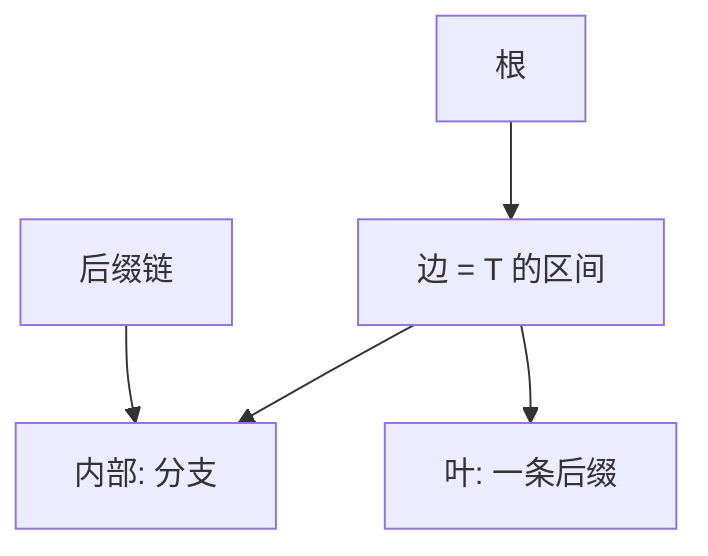

# 后缀树

压缩 trie 挂上文本的全部后缀；从根到叶的路径标出一条后缀，子串查询变成沿边走字符。

<footer>—— 据 Weiner, Linear Pattern Matching Algorithms, SWAT 1973；Ukkonen, On-Line Construction of Suffix Trees, Algorithmica 1995；Gusfield, Algorithms on Strings, Trees, and Sequences 整理</footer>

[上一课](/cs/lcp-kasai) 用数组隐式表达相邻 lcp。需要显式 coprime 边、后缀链、或 $O(|P|)$ 查找（字母表常数时），树更直接。[Trie](/cs/trie) 不压缩会 $\Theta(n^2)$ 节点。本课不重写 Kasai 循环。缺口是后缀树：压缩后缀 trie，线性节点。

## 问题

每个内部节点对应某子串的全体出现的分支点；边用 $T$ 的下标对表示（不拷字符）。叶对应后缀。查询 $P$：从根沿边匹配，失败则 $P$ 不是子串，成功则子树叶即出现位置。缺口是**线性规模的显式后缀 trie**，以及后缀链（内部节点连到较短后缀）支撑线性构造。

Weiner 1973 离线线性；McCreight 更省；Ukkonen 在线。Gusfield 书是串算法标准叙述。本课钉结构与查询，不默写 Ukkonen 全部活动点 case。

## 方法

查询 $O(|P|)$ 字符比较（边跳过用长度）。出现次数 = 子树叶数，可预处理 size。LCE、最长重复：最深内部节点。与 $SA+LCP$：后缀树可用前者隐式模拟，空间常更大但指针语义清楚。

构造：教学可用 $O(n\log n)$ 插后缀 + 压缩；线性算法承认存在。字母表大时边表用 map，时间多 $\log|\Sigma|$。

## 机制

压缩：一元路径合成边，节点 $O(n)$。正确性：全体后缀恰好覆盖所有子串（子串是某后缀前缀）。不要存每条边的显式字符串拷贝。

与后课 SAM：自动机把结束位置等价类收成更少状态，后缀树节点与 SAM 状态有对应，本课不提前最小化。

## 边界

本课不把 Weiner 证明写完。外存后缀树难；实践大文本用 $SA$。回文结构不是后缀树默认合同。

后课默认：要显式后缀 trie 用后缀树。要最小接受全部后缀的自动机，用 SAM。

## 小结

- 后缀树：压缩后缀 trie，查询 $O(|P|)$，节点 $O(n)$。
- 边存下标对；后缀链服务构造。
- 最小后缀自动机是下一课。
- 出处：Weiner, 1973；Ukkonen, 1995；Gusfield。
