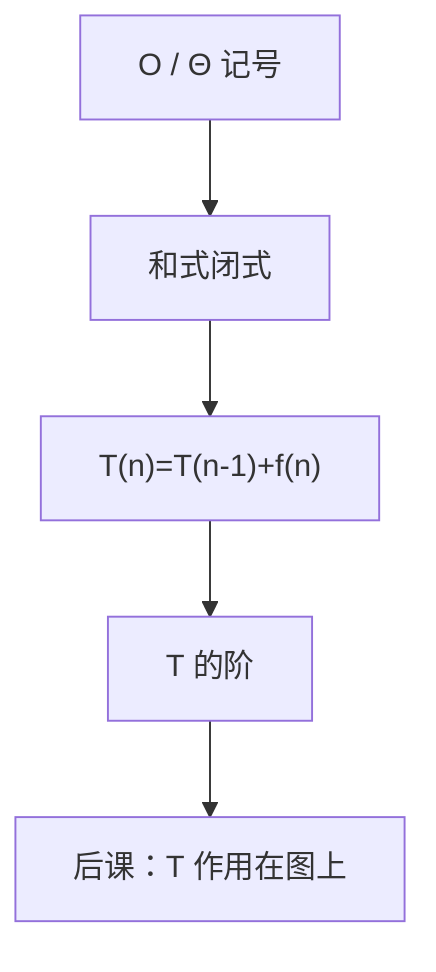

# 常见和式与递推

$T(n)=T(n-1)+n$ 展开就是三角数；几何和与调和和决定了后课循环代价是平方、指数还是对数。

<footer>—— 据 Rosen, Discrete Mathematics and Its Applications；Cormen, Leiserson, Rivest and Stein 整理</footer>

上一课[渐近记号](/cs/asymptotic-notation)钉死了 $O$、$\Omega$、$\Theta$ 比较增长，当时假定 $T(n)$ 已经是闭式或已知阶。本课不重定义 $n_0$ 与 $c$，也不从主定理另起——主定理是算法课分治叶子。缺口是：循环与简单递归给出的是**和式或递推**，还不是闭式。没有求和，记号没有对象。

## 问题

一层循环加到 $n$ 是 $\sum_{k=1}^n 1=\Theta(n)$。嵌套或 $T(n)=T(n-1)+n$、$T(0)=0$ 展开为 $\sum k=\Theta(n^2)$。缺口因此不是新的 $O$ 定义，而是几张表：等差 $\sum k=n(n+1)/2$，等比 $\sum r^k$ 在 $|r|<1$ 时有界、$r=2$ 时 $\Theta(2^n)$，调和数 $H_n=\sum_{k=1}^n 1/k=\Theta(\log n)$。展开线性递推 $T(n)=T(n-1)+f(n)$ 得 $T(n)=T(0)+\sum f$。

分治 $T(n)=2T(n/2)+n$ 只点到「展开成 $\Theta(n\log n)$」，证明留给后课主定理。本课够用的是减一递推与有限和。

### $\Theta$ 不是求和过程

先求和或展开，再对闭式套上一课的记号。把「循环两层」直接写成 $O(n^2)$ 可以当口诀，但 $f(n)$ 若是 $2^n$，层数不再给出多项式。本课要求能认出和式形状。

Rosen 给出求和公式与递推求解。CLRS 在渐近章之后用求和估计循环。调和和出现在哈希与树的平均高度直觉里，严格期望要等概率课。

## 方法

算术和、几何和按闭式。调和和用积分夹逼得到 $\Theta(\log n)$，本课不把 Euler 常数当必考。递推：反复代入直到 $T(0)$，再对和式套 $\Theta$。归纳可验证猜出的闭式——[数学归纳](/cs/mathematical-induction)的格式在此当检验，不代替展开。

## 机制

后课邻接表扫描是 $\Theta(V+E)$，来自「每边、每点常数次」的和，不是新记号。树高最坏 $\Theta(n)$、平衡后 $\Theta(\log n)$，对数来自反复减半或调和型代价。本课先把和与减一递推钉死，图的 $|V|$、$|E|$ 下一课才成为参数。

## 边界

本课不引入生成函数解线性递推的一般理论，不证主定理全部情形。摊还分析是后课数据结构叶子。连续积分只当夹逼工具。

后课默认：循环代价先写成和或减一递推，再收成 $\Theta$；图算法的 $T$ 用 $|V|$、$|E|$ 当自变量。

## 小结

- 等差、等比、调和和给出后课最常用的阶。
- $T(n)=T(n-1)+f(n)$ 展开为 $f$ 的和。
- 记号上一课已有；本课给 $T(n)$ 从哪来。图是下一课的对象。
- 出处：Rosen；CLRS。
