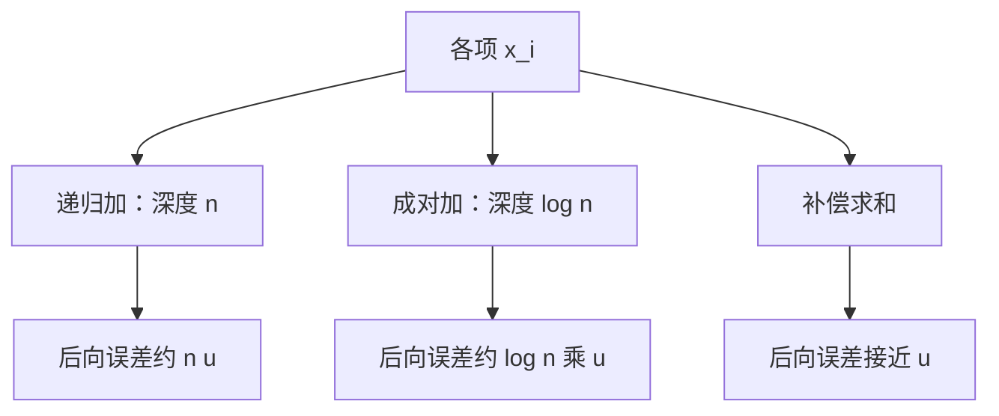

# 求和顺序

实数加法可结合；浮点加法每步舍入，先加谁等于选择哪一次差被丢掉——顺序是算法，不是括号游戏。

<footer>—— 据 Higham, Accuracy and Stability of Numerical Algorithms；Trefethen and Bau, Numerical Linear Algebra 整理</footer>

上一课[消去与灾难抵消](/cs/catastrophic-cancellation)说明近量相减会吃掉有效位。本课不重写有理化，也不从并行归约树的硬件另起。缺口是：许多项相加时，每步都是一次 $\mathrm{fl}(+)$，**结合律失败之后，顺序怎样改变后向误差，补偿算法补的是哪一块**。这是「浮点之后」课序的末课，下一课转入线性方程。

## 问题

$\sum x_i$ 在实数里与括号无关。机器上递归 $s_{k}=\mathrm{fl}(s_{k-1}+x_k)$ 把每步 $\delta$ 乘进后续所有加法。大数先入再加一串小数，小数可能对 $s$ 毫无贡献（吸收）；异号近量交错则反复抵消。缺口因此不是「求和会有误差」，而是**顺序与分组是算法选择**：它们改变误差传播路径，有时也制造或避免抵消。

条件数：求和问题相对 $\sum|x_i|$ 的条件大约是 $\sum|x_i|/|\sum x_i|$，异号时病态。算法再差，也不能突破这个下界。本课在良态与病态之间都给可做的事：排序、成对、补偿。

### 更高精度累加器不是「换了问题」

用更宽寄存器做 $s$ 再舍入回工作精度，是在减少算法注入，问题 $f$ 仍是原来的和。这与改写成别的数学式不同。Kahan 补偿在工作精度里多记一项校正，目标同样是压低后向误差，不是把条件数变小。把补偿当成「数学上改了定义」，会与下一课主元选择的动机搅在一起。

Higham 专章讨论 summation。Trefethen and Bau 用浮点加法的非结合当作贯穿全书的提醒。本课不把所有并行 reduction 的确定性保证写完。

## 方法

递归求和：后向误差 $O(nu)$，常数随顺序变。按绝对值递增加，往往减少吸收。成对（二叉树）把深度降到 $\log n$，界更好且利于并行。Kahan：维护校正项 $c$，每次把丢掉的低位补回——在典型硬件上把有效误差从 $O(nu)$ 降到接近 $O(u)$。排序与补偿可以组合，病态和仍可能不准。

内积是带乘法的求和，顺序与是否 FMA 同样改变 $\delta$ 的个数。BLAS 的具体顺序是实现细节；分析时按最坏或按其后向保证来用。

内积、多项式 Horner 求值、矩阵行和都是求和的变体：Horner 把顺序钉成嵌套乘加，通常比展开成高次幂再加更稳，因为它改变了 $f$ 的求值路径。补偿可以嵌进内积，但 BLAS 为了速度常常只用递归加。分析时把实现宣称的后向保证当规格，而不是假定「数学上的和」。下一课消元里的更新是许多次 saxpy，顺序由主元给定，误差图像从求和换成秩一更新。

## 机制

每次加法把较小操作数的低位对齐后丢掉。顺序决定谁当「较小」：累加器变大后，后来的项更容易被吸收。树状分组让中间和的量级更接近，减少这种不对等。补偿显式把丢掉的尾数留到下一步——等于多保存一点部分和的信息。这些都不改变 754 的位型，只改变舍入发生的位置与次数。

并行规约树的形状也是顺序：同一组数，不同线程划分会得到差几个 $u$ 的结果。需要位对位复现时，必须固定树或改用高精度累加，而不能只固定源码里的 `for` 循环——编译器也可能再结合。Kahan 的校正项本身是浮点，极端动态范围下仍会丢。对符号相同、量级可比的项，递归和已经够用；对异号或跨很多个数量级的项，先问条件数，再决定是否补偿。线性代数的消元把「选哪一行」当成同一类顺序问题，只是对象从加数换成了行。

## 边界

本课不保证并行归约的位对位可复现，那是实现与规约树的契约。下一课[高斯消元与主元](/cs/gaussian-pivoting)把「顺序」换成行交换，对象从求和换成消去。后课默认：浮点求和不可结合；顺序与补偿属于算法；和的条件数仍由数据符号结构决定。

## 小结

- 浮点加法不结合；顺序改变吸收与抵消路径。
- 递归和后向误差常 $O(nu)$；成对与 Kahan 压低算法注入。
- 异号求和可以病态，补偿救不了条件数。
- 下一课把稳定性问题接到线性消去。
- 出处：Higham；Trefethen and Bau。
