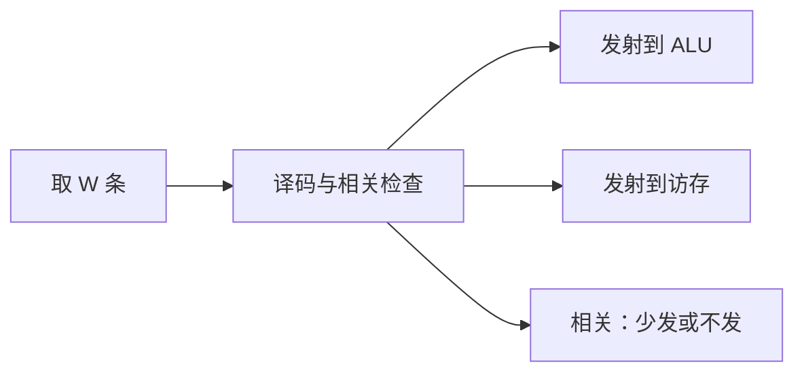

# 超标量发射

理想 CPI 已经是 1 时，再降时间只能每拍取出并启动多于一条指令。

<footer>—— 据 Hennessy and Patterson, Computer Architecture: A Quantitative Approach 整理</footer>

[上一课](/cs/coherence-intro)指出多副本尚未有协议，但单核流水线的 CPI 公式已经够用。[CPI 与阿姆达尔](/cs/coherence-intro)把理想项钉在 1。[流水线五级](/cs/pipeline-five-stage)每拍推进一级、每拍取一条。本课不重讲转发。缺口是：指令级并行若存在，硬件每拍仍只发射一条，吞吐封顶。本课只交出超标量：每拍译码并发射最多 $W$ 条，理想 CPI 变成 $1/W$。一致性协议仍未实现，本课不靠多核。

## 问题

程序里相邻指令常常不相关：一条在 ALU，一条在访存。五级顺序发射把它们排成一列。缺口不是更长的流水线（那只提高频率、加深控制冒险），而是**加宽取指/译码/发射**，让独立指令进入不同功能单元。

结构冒险回来了：每拍可能要两个 ALU、两个寄存器读口、两条 cache 端口。上一课的一致性问题在单核超标量里仍可搁置；端口不够则不能真的双发。

超标量是每拍多条标量指令；SIMD 是一条指令多条数据，后课才拆开。

## 方法

取指带宽加到 $W$ 条，译码检查这 $W$ 条之间以及与已在流水线中指令的 RAW。可同时发射的送进对应单元；相关则只发前缀，或整组停顿。仍保持程序序发射：更年轻的不得越过年长且相关的。

寄存器堆读口、cache 端口按 $W$ 复制。控制冒险的损失拍数若不变，每拍扔掉的指令变多，预测更重要。本课不引入乱序执行。

## 机制

IPC 上限为 $W$，实际受依赖、分支、缺失限制。阿姆达尔仍适用：不能双发的那部分代码把平均 IPC 往 1 拉。编译器调度可以拉开相关距离，让窗口内更常填满 $W$；硬件必须在任意二元组上正确。

精确异常仍按程序序：即使两条同拍发射，提交仍要像顺序机。顺序超标量可以用「两条都过提交点才一起写」或按序写回。乱序才是下一课。

## 边界

本课不引入重命名、保留站、ROB。也不把发射宽度写成「核数」：那是多核课。VLIW 把打包交给编译器，主干不转向。

后课默认：单核可以每拍尝试发射多于一条；相关与缺失仍按五级那套检测，只是端口变多。真正把后面独立指令提到前面，靠乱序。

## 小结

- 理想 CPI 从 1 降到 $1/W$ 需要每拍发射最多 $W$ 条。
- 顺序超标量仍按程序序发射；结构端口必须加宽。
- 乱序与 ROB 是下一课的缺口。
- 出处：Hennessy and Patterson, *CA:AQA* 指令级并行与超标量。
