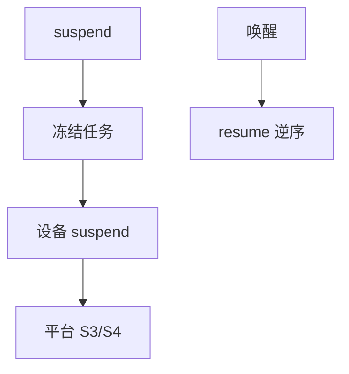

# 挂起与恢复

休眠把设备 freeze、内存写入交换或固件睡眠态；恢复按相反顺序解冻，时间与驱动质量决定成败。

<footer>—— 据 Linux power 文档对 suspend/hibernation 的说明；ACPI S3/S4；[cpuidle](/cs/cpuidle-cstate) 为浅睡眠对照</footer>

[udev](/cs/udev-hotplug) 管插拔。[C-state](/cs/cpuidle-cstate) 是核闲。缺口是 **整机睡眠**：freeze 任务、设备 `suspend` 回调、与休眠镜像。安全/启动课序在此收口，观测下一课序。

## 问题

S3：RAM 自刷新，外设断电。S4：内存写盘。freeze：用户进程停。缺口：驱动未实现 suspend 则失败或丢设备；与 [PREEMPT_RT](/cs/preempt-rt) 延迟；加密根要恢复路径解封。本课不把每家 BIOS 坑列出。

userspace freeze 与 freezer cgroup 亲戚。对象是电源状态机，不是调度时间片。

## 方法

`echo mem > /sys/power/state` → freeze → 设备 suspend → 平台睡眠。唤醒：resume 相反。对照 [热插拔内存](/cs/memory-hotplug)：睡眠中 DMA 必须停。对照 [NVMe](/cs/nvme-driver)：要保存队列状态或重置。对照 TPM：PCR 在 S3 可能变化，策略要设计。

## 机制

挂起把「看起来关机、RAM 还在」收成驱动协议。失败表现为 USB 死、时钟错、无法唤醒。不要写成笔记本评测。与 [fsync](/cs/fsync)：休眠前应刷盘。与 [KPTI](/cs/kpti-os)：恢复后页表仍要正确。

hibernate 镜像是攻击面，需加密。

实现上：freeze 用户进程后还要 freeze 内核线程的可冻集合。驱动 resume 顺序与父子设备相反。hibernate 镜像未加密等于 RAM 落盘明文。 读法上只引用[上一课](/cs/udev-hotplug)的结论，不把对象换成训练推理或限价簿。

本课在操作系统进阶的「安全、启动与调试 / 内核安全与启动」课序里，对象是 **挂起与恢复**。

- 先修只引用，不重导：上一课的结论当公理，本课只补差。
- 五栏不吞并：不把本课写成大模型训练/推理，也不写成限价簿或权重量化。
- 文献用 OSTEP、McKusick、内核文档与具名会议论文；不发明 arXiv 编号。

## 边界

本课不引入所有 runtime PM 的自动闲。不保证虚拟机 S3。下一课序观测：printk。

版本字段会变，课序钉的是机制对象「挂起与恢复」，不是某一主线内核的结构体名。
后课默认：整机睡眠走 freeze+设备回调。内核如何把消息打出来，下一课 printk。

## 小结

- suspend/hibernate 冻结任务并回调驱动。
- 比 C-state 深，依赖固件与驱动。
- printk 是下一课序。
- 出处：Linux power；ACPI；设备 PM。
