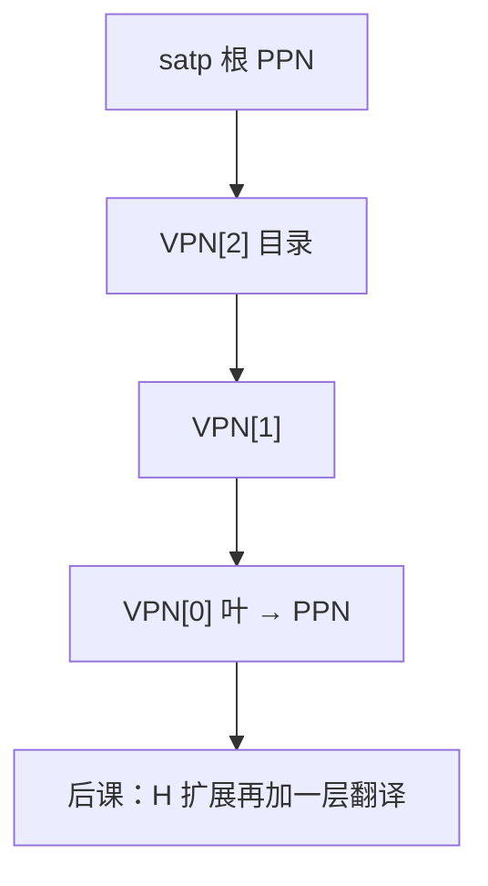

# Sv39 页表格式

  
39 位虚拟地址切成三级 VPN，每级 9 位索引 512 项的页表页；叶 PTE 给出 PPN 与权限，硬件或软件走访这棵树。

  <footer>—— 据 The RISC-V Instruction Set Manual, Volume II: Privileged Architecture；Patterson and Hennessy, Computer Organization and Design (RISC-V) 整理</footer>

[上一课](/cs/riscv-compressed)只影响取指字节。[多级页表](/cs/multi-level-page-table)已给树直觉，并点名 Sv39。缺口是 **格式**：PTE 位、`satp` 模式、与 x86-64 四/五级、ARM 多级对照时能指到具体字段。

## 问题

Sv39：VA[38:12] 为 VPN，三级各 9 位，4 KiB 页。PTE：PPN、V/R/W/X/U/G/A/D 等。`satp` 存根 PPN 与 ASID、MODE=Sv39。缺口不是再画三级框图，而是这张**位布局**以及巨页（叶在上级标叶子）如何编码。

Sv48 再加一级，思想同。x86 `CR3`+4 级 9 位类似；ARM 用 TTBR 与不同块大小。本课以 Sv39 为钉。

### Sv39 不是「39 位物理地址」

物理地址宽度由实现的 PPN 位决定，可以更宽。39 是虚拟地址canonical 空间（符号扩展到 64）。把 Sv39 当内存容量上限，HBM 容量故事会错。

RISC-V Privileged Spec 是权威。Patterson/Hennessy 教学分页。对照 [EPT](/cs/ept-npt)：那是第二层翻译，Sv39 是客或宿主的第一层。

## 方法

TLB 缺失：用 `satp.PPN` 为根，VPN[2] 索引，读 PTE，若非叶则 PPN 为下一级表，直到叶。故障：V=0 或权限不符 → 缺页/保护，写入 `scause`/`stval`。A/D 位由硬件或软件置，实现可选。

与 [DMA](/cs/dma-scatter-gather)：IOMMU 可用类似格式或另规格，不是 `satp` 本身。

## 机制

下一课虚拟化 H 扩展：G-stage 翻译把客物理再走一遍，类似 EPT。本课只钉单层 Sv39。fence.vma 刷新 TLB，与[内存 fence](/cs/fence-instructions) 不同对象。

## 边界

本课不把 Sv57 写完，不背每保留位。不讨论页表自己的 cache 着色。不进入 Windows 的 x86 格式对照作业。

后课默认：RISC-V Sv39 是三级 9 位索引的 PTE 树；`satp` 选模式。

## 小结

- VA 39 位，三级页表，4 KiB 叶。
- PTE 含 PPN 与 RWX/U；`satp` 指向根。
- 虚拟化下一课加 G-stage。
- 出处：RISC-V Privileged Spec；Patterson and Hennessy, COD (RISC-V)。
