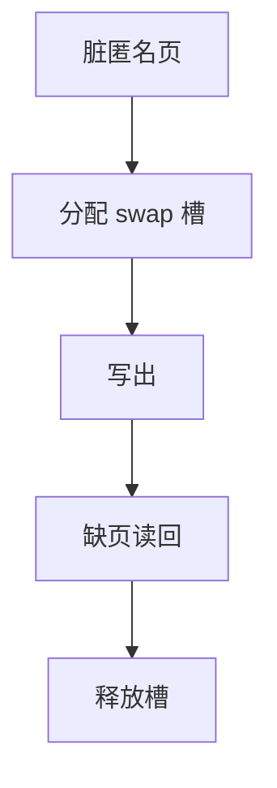

# 交换设备

swap 是一块专用于匿名页的后备空间：按页槽编址，不经文件名，也不保存用户可见的目录树。

<footer>—— 据 Tanenbaum and Bos, MOS；Bovet and Cesati 对 Linux 交换的整理</footer>

[上一课](/cs/anon-vs-file-page)规定脏匿名页必须写出。[磁盘调度](/cs/disk-sched)尚未到，但块设备已经能接受读写。缺口是**槽位**：交换区是页的数组，内核把「进程 + 虚页」映射到槽，换入时按槽读回帧，再恢复 PTE。不是再做一个用户文件。

## 问题

若把每个匿名页写成临时文件，目录与 inode 操作太重，抖动时更糟。经典做法：整块分区或定长 swap 文件，内部只有槽位位图与少量头。缺口：分配槽、写页、在 PTE 或换出表里记下槽号、换入、释放槽。多块 swap 可以有优先级。加密与压缩是实现，不改「页 ↔ 槽」模型。

本课不把 hibernation 镜像格式写完。

swap 文件仍占用文件系统空间，但内核用 bmap 记住槽对应哪些块，热路径不再查目录。优先级让快设备先吃换出。

## 方法

`swapon` 登记设备。换出：位图取空槽，DMA 写一页，PTE 无效并编码槽（或指向 swap cache 项）。换入：缺页见槽号，读块，填帧，释放槽或留下缓存以免马上再换出。与[按需调页](/cs/demand-paging)同一条重试指令路径。槽耗尽则分配失败，下一课 OOM。

## 机制

交换设备把 RAM 的下一层从「文件」换成「匿名专用介质」，让堆、栈在物理压力下仍可前进。它放大抖动：每个 major 缺页都是一次块 I/O。工作集控制若失败，swap 吞吐会顶满，CPU 在等盘。不要把关系库的表空间当成 swap；那是数据库栏。

[TLB](/cs/tlb-translate) 在换出后必须不含该 VPN，shootdown 规则照旧。

## 边界

本课不引入 zswap 内存压缩池的调参。不保证 swap 文件在所有文件系统上性能相同。无 swap 的机器把压力直接交给 OOM，下一课。也不把 NUMA 的每节点 swap 写进主干。

后课默认：匿名页有槽可去。槽与帧都尽时如何选进程牺牲，下一课 OOM killer。

## 小结

- swap 按页槽备份匿名页，不走用户路径名。
- 换入仍是缺页路径上的 major I/O。
- 槽与内存双尽是 OOM 的缺口。
- 出处：Tanenbaum *MOS*；Bovet and Cesati, *ULK*；Silberschatz et al., *OSC*。
