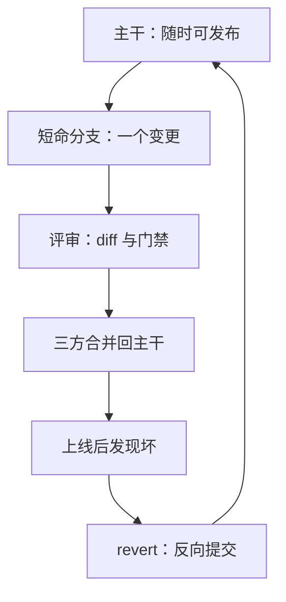
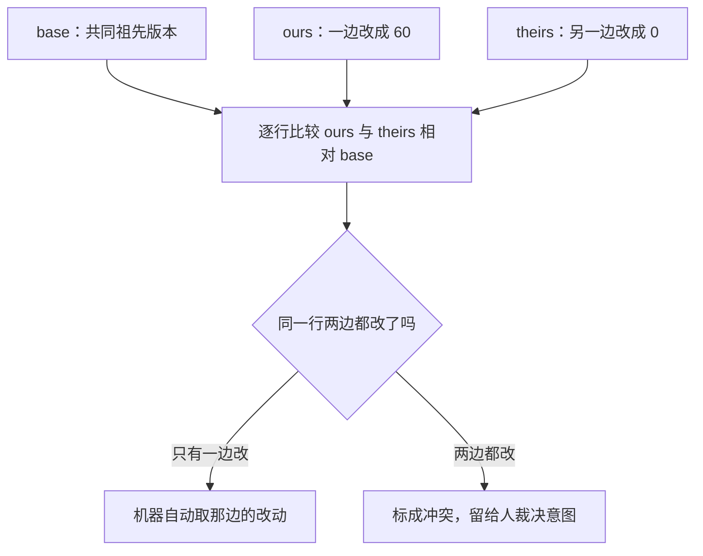

# 分支与变更管理

分支廉价，相遇昂贵；分支策略的全部内容，是控制两条改动线再次相遇时要付的那笔账。

<footer>—— 据 Chacon and Straub, Pro Git 的分支与合并章节整理</footer>

[上一课](/cs/swe-git-internals)把 git 拆成内容寻址的对象库，分支只是一个可移动的指针，创建近乎免费。正因免费，「何时开、开多久、何时合、合不进去怎么办」才成为纯工程问题。本课写：单一主干与短命分支的拓扑，合并与变基在对象图上的后果，变更进主干前的评审与门禁，以及坏改动的退路。

## 问题

单一主干上并行改动会互相踩；用长期并行分支隔离，又积累漂移：分叉越久，两个分支相对共同祖先走得越远，合并时冲突面越大，最后合并一次痛一周。变更管理的缺口因此是一套规则：谁、在什么条件下、能把改动放进主干；以及放错了怎么在分钟内退出来，而不是靠一次新的冒险把它冲掉。

代个数感受漂移速度：主干每天进 100 个提交，你的分支拖两周才合，共同祖先之后多了约 1400 个提交可能与你的改动落进同一批文件；拖两天则只有约 200 个。「分叉时长是唯一要压缩的量」说的就是这个分母。

## 方法

拓扑取最简：主干（main）保持随时可发布；每个变更一支短命分支，天级生命周期，小步合并回来。合入用三方合并：机器找两支的共同祖先作 base，把两边相对 base 的改动叠加；只有两边改了 base 同一处才报冲突。变基把本支提交摘下重放到目标顶端，对象图上线性，但产生新对象、新哈希，等于重写历史——只对自己尚未给别人的提交做；共享分支上的重写，会换掉别人脚下的地面。

合入的载体是变更评审：一段 diff、一份门禁清单、至少一双别的眼睛。[版本控制与变更](/cs/vcs-changeset)课已经说明契约与测试要同提交；评审核对的就是这一条——diff 里有没有行为改动不带的判据。退路是 revert：生成一笔反向提交把改动抵消，历史只增不改；对已发布分支 force-push 重写历史，等于宣布所有人的克隆作废。

## 机制

冲突是文本三角：base、ours、theirs 各一份，机器逐行比较。它标得出「两边都动了这一行」，裁决不了意图——base 里一行 `timeout = 30`，一边改成 60，一边改成 0，git 能列出冲突，说不出哪边对；语义对齐靠评审与上一课的集成层。主干健康的不变式「任何时刻可发布」还把两个决定拆开：合入不等于发布，没做完的功能用开关关着进主干。长命分支多半在隔离「没做完的功能」；开关接手这个职能之后，分支才真正短得下来。

术语翻译：开关（feature flag）就是一个运行时布尔配置，把「代码已进主干」与「功能对用户可见」解耦——代码合了、开关关着，用户看不见。它接过了长命分支原来「隔离未完成功能」的职能。

把文本三角逐行比较后机器能裁什么、不能裁什么，拆开看。

初学者容易把「合并冲突」当成 git 出故障。实际上冲突标记是机器在诚实地说「这一行我裁不了」——它能自动合的都合了，剩下的需要人比对两边意图，这正是评审存在的理由之一。

「天级合并」的量化理由：冲突面随分叉时长增长——分叉一周，别人对同一批文件的改动就叠了一周，base 越老，三方合并要人工裁决的行越多。把冲突从大爆炸摊薄成小摩擦，是短命分支的全部数学。

## 边界

本课不写平台按钮（托管服务的合并界面与状态机）；fork 加维护者的开源工作流只是拓扑变体；monorepo 下依赖图的合并与构建影响留到后面构建与 CI 两课；大文件与仓库容量治理不展开。开关也有成本：常年开着的开关堆积成第二套分支——入口只有一处，纪律仍在人。

## 小结

- 单一主干加短命分支：分叉时长是唯一需要压缩的量。
- 三方合并以共同祖先为 base；冲突是文本三角，意图要人裁决。
- 变基重写历史、更换哈希，只对未共享的提交使用。
- 评审核对「判据与行为同进同出」；revert 用反向提交留退路，不重写历史。
- 开关解耦合入与发布，是分支能短命的制度前提。
- 出处：Chacon and Straub, *Pro Git*, 2nd ed., Apress, 2014；变更集口径见[版本控制与变更](/cs/vcs-changeset)。
