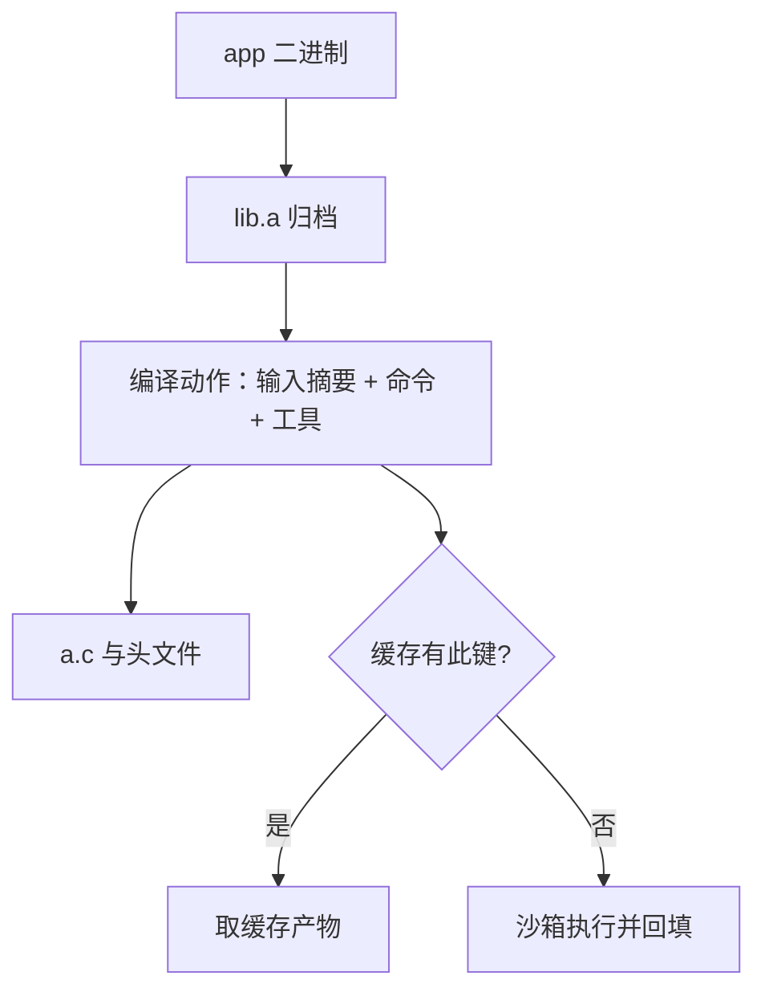
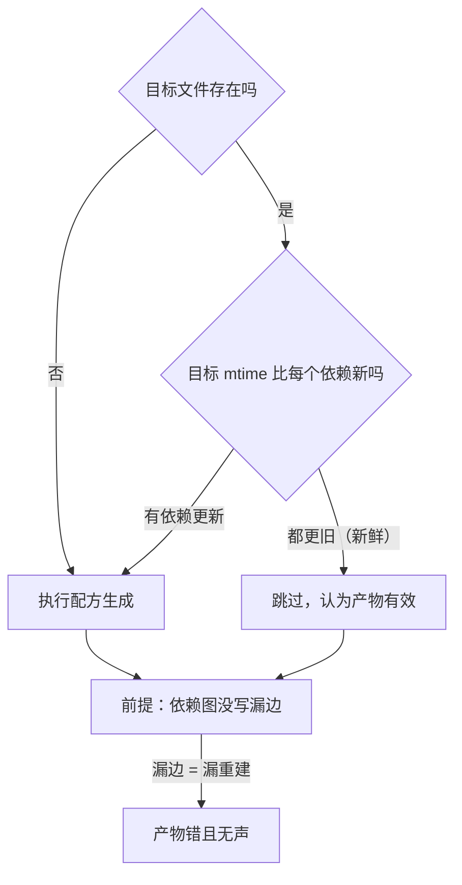

# 构建系统：make 到 bazel

增量构建的全部正确性押在一个判据上——这件产物还新鲜吗；时间戳是猜测，内容哈希是事实。

<footer>—— 据 GNU Make 手册与 Bazel 的密封性、缓存文档口径整理</footer>

[上一课](/cs/swe-branching-changes)把变更收进主干，主干上每一份快照都要能变成可发布的产物。程序设计课的[构建系统](/cs/build-system)已经写过 make 的目标、依赖与配方；本课沿工程纵深重走一遍：make 的时间戳增量为什么在大团队失效，bazel 的内容寻址动作图怎么补，密封性为什么是这一切的前提。后课的 CI 默认你已经会动作图与缓存键。

## 问题

make 的判据是「目标比依赖旧就重建」，它有三个失效口。时间戳本身不可靠：检出与克隆不保序、文件系统粒度粗、时钟会跳。依赖图靠人写：写漏一条边就漏重建，写全又手工爆炸——[C 预处理器](/cs/c-preprocessor)课写过翻译阶段把包含展开，头文件因此都算依赖，机器算得比人准。更根本的是非密封：编译器版本、系统头文件、环境变量都悄悄进结果，「在我机器上能过」没有工程意义。三个口合起来的日常就是：增量结果不可信，于是人人 clean build，增量白做。

## 方法

把构建声明成动作图：目标为点、动作为边的有向无环图，系统做拓扑排序，无依赖关系的动作并行。bazel 给每个动作定义封闭的键：输入内容摘要、命令行、工具与环境都在键里。键相同就直接取缓存产物，本地缓存与远端缓存共享，跨人跨机一致——「同一主干快照，得到同一产物」。密封性是前提：工具链版本钉死，sysroot 口径见[交叉编译与三元组](/cs/cross-compile-triple)；依赖版本锁定；动作在沙箱里执行，主机的环境变量与全局目录进不了结果。

数字实例看增量值多少钱：一个中型仓库全量构建 40 分钟、可信增量 30 秒。判据不可信时人人 clean build，百人团队每天几十次构建，浪费的就是按小时计的机器与人等——增量正确性是工程问题，不是小优化。

## 机制

判据升级的本质，是从偏序启发式走到精确判据。mtime 比较错了，结果错且无声；内容摘要不会错——输入没变就是没变，变了哈希必变。CI 因此可以信任构建产物：键相同即产物相同，[git 的内部模型](/cs/swe-git-internals)里「哈希即校验」的思路在产物侧重演一遍。把「同源同产物」推到字节级一致，就是可复现构建，配套的物料清单见[SBOM 与可复现构建](/cs/sbom-reproducible-builds)。

术语翻译：密封性（hermeticity）就是「构建动作能看到的每一份输入都被显式钉住」——源码、依赖版本、工具链全在图里，动作跑在沙箱中；主机上恰好装了什么编译器、设了什么环境变量，都影响不了结果。

make 每一步「重建还是跳过」的判定本身值得画出来。

初学者容易以为增量判据写错顶多「多编译几遍、慢一点」。实际反过来：漏写一条依赖边是**少**重建——旧目标文件被链接进产物，程序带着旧逻辑照常跑，错误无声。bazel 的内容键就是把这个「错且无声」变成「定义上不存在」。

亚秒粒度的具体错法：同一秒内先更新头文件再更新源文件，mtime 相等，make 认为 .o 仍然新鲜——经典的「偶发不改」。动作键里没有时间、只有内容摘要，这类问题在定义上消失，而不是被修好。

## 边界

bazel 有成本：规则要学、外部依赖要进图、分析期有开销，小项目全是负担；make 不会死——小项目、胶水流程、单目录工具链，它仍是最短路径。生成代码会让依赖图出现「产物又是另一个目标输入」的环，切环技巧与各语言规则生态不展开。构建可复现不等于程序无副作用：运行时行为归测试与交付管。

## 小结

- make 以时间戳判新旧，bazel 以内容摘要判同一；判据错了，增量就错。
- 动作图加封闭键，使产物可缓存、可共享、跨机一致。
- 密封性是缓存的前提：工具链钉死、依赖锁定、沙箱执行。
- 头文件等隐藏依赖应进图；漏边是漏重建的根源。
- 小项目用 make，多语言大库上 bazel；选择随规模不随时髦。
- 出处：GNU Make 手册；Bazel 文档（密封性与远端缓存口径）；交叉编译见[交叉编译与三元组](/cs/cross-compile-triple)。
