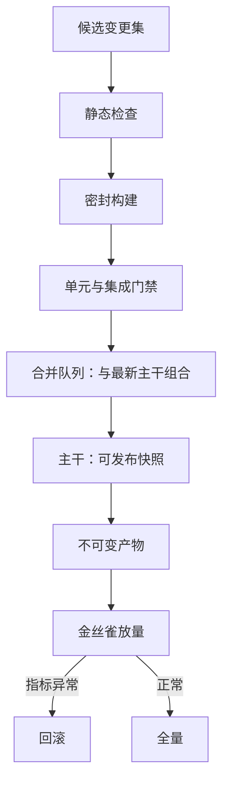

# CI/CD

持续集成不是服务器上多跑一遍测试，而是把「主干随时可发布」从愿望改成机器在每个变更集上执行的断言。

<footer>—— 据 Humble and Farley, Continuous Delivery, 2010；Beck, Test-Driven Development, 2003 整理</footer>

[上一课](/cs/swe-build-systems)把构建做成内容寻址的动作图，同一份主干快照在任何机器得到同一产物。本课把这套判据装进自动执行的服务：合入前对候选变更跑门禁，合入后产物自动走发布路径。三层判据（[测试策略：单元、集成与属性](/cs/swe-testing-strategy)）在这里从自觉变成制度。

## 问题

本地绿不等于主干绿：各自本地绿、合并后红的语义冲突在[分支与变更管理](/cs/swe-branching-changes)已经见过；本地与构建环境的漂移在密封性一课也见过。剩下的是制度缺口：需要一台不受本地状态污染的机器，对每个候选变更集执行同一套判据，并且让「没过门」的改动在物理上合不进去——门禁若可以顺手跳过，它就是装饰。

## 方法

流水线把判据排成序列：候选变更进来，先静态检查（[静态与污点分析](/cs/static-taint-analysis)的口径），再密封构建，再单元层，再集成层，全绿产出不可变产物（镜像分层见[OCI 镜像层](/cs/oci-image-layers)）。多个变更并发时用合并队列：把队列里每个变更依次与最新主干组合验证，堵住「每个单独绿、叠起来红」的缝。合入后 CD 接管：同一产物逐环境晋级——dev、staging、prod——不在各环境重建；金丝雀放量，指标异常即回滚；没做完的功能用开关关着，口径见[分支与变更管理](/cs/swe-branching-changes)。

## 机制

门禁的经济学在反馈时间：门禁快，人就小步合入，失败归因小；门禁慢，人就攒批，revert 粒度跟着变大。上一课的缓存键在这里兑现：门禁只重算受影响的动作，分钟级预算才守得住。flaky 测试是门禁的毒药：它让红不再必然指示回归，团队开始重跑，而重跑成功一次，门禁的可信度就降一分。治理办法是把重试隔离并记录：重试预算固定，二次失败必须阻塞。跳过门禁要有留痕与授权，否则断言退化成装饰。

量化：单个测试失败率 1%，一百个变更的门禁里期望放大约一次假红；按至少一次口径 $1-(1-0.01)^{100}\approx 0.63$。若「重跑变绿就放行」成为习惯，真回归混在重跑里被放行的概率同步上升——重试必须留痕，才有得查。

## 边界

CI 不替代评审：门禁判行为，评审判意图与设计，两者在合并队列里会合。部署形态的对照（滚动、蓝绿、金丝雀的适用面）与发布编排不展开；供应链攻击面——依赖混淆一类——见[依赖混淆](/cs/dependency-confusion)，安全扫描管线只点名。门禁时长超过人愿意等的阈值，绕过就开始：预算是制度的一部分，不是性能细节。

## 小结

- CI 是制度化的判据执行：没过门的改动在物理上进不了主干。
- 合并队列堵「单独绿、叠起来红」；产物不可变，环境只晋级不重建。
- 反馈时间决定合入批量；缓存使门禁守住分钟级预算。
- flaky 用隔离重试与固定预算治理，重跑变绿不等于回归不存在。
- 跳过门禁要留痕授权，否则断言沦为装饰。
- 出处：Humble and Farley, *Continuous Delivery*, 2010；判据分层见[测试策略：单元、集成与属性](/cs/swe-testing-strategy)。
