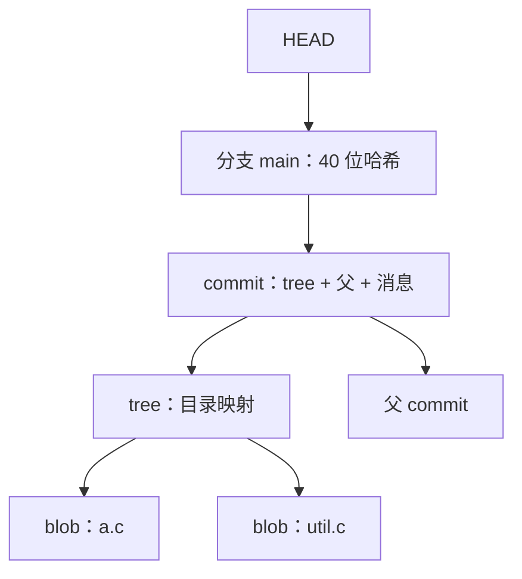

# git 的内部模型

把内容按哈希入库，把名字做成指针：版本控制的全部机制都从这两个决定里长出来。

<footer>—— 据 Chacon and Straub, Pro Git, 2nd ed., 2014 整理</footer>

[上一课](/cs/swe-testing-strategy)把「改对了没有」交给三层判据，但判据必须挂在某次具体改动上：这一笔到底改了什么、哪一笔引入的回归。早先的[版本控制与变更](/cs/vcs-changeset)课把变更集定义为可命名的快照差，并说明测试要与实现同提交，历史才能回放规格。本课写 git 把这套模型落在什么数据结构上：blob、tree、commit 与引用。后面的分支、构建与交付各课默认你已经会这个内部模型，不再把「分支是指针」当新知讲。

## 问题

备份目录式的历史三条都做不到：命名靠手工（v2-final-final2），无完整性校验（盘坏了不知道少了哪个字节），分支靠整树复制（几 GB 一份）。工程需要的账本是：任何历史状态可命名，任何字节被改可察觉，从任何状态派生新线近乎免费。而且这三条要在仓库增长后仍然成立——按仓库大小收费的分支，会让人不敢分支。

## 方法

git 只有四种对象。blob 存文件内容；tree 存目录，即「名字到 blob 或子 tree」的映射；commit 指向一个 tree，记录父提交、作者与提交消息；tag 给任意对象贴注解。所有对象以内容的 SHA-1 哈希为名，放进 .git/objects。工作区任何时刻对应某个 commit；暂存区（index）是下一个 commit 的 tree 的草稿，`git add` 把文件内容做成 blob 放进去，`git commit` 把草稿冻结成 tree 并新建 commit 对象。分支与标签都是引用（ref）：存着 40 位十六进制哈希的指针文件；HEAD 记录当前所在。

## 机制

内容寻址长出三个推论。其一，去重：内容相同即哈希相同，未变动的文件在提交之间共享同一个 blob。其二，完整性：哈希即校验和，历史任何字节被改，其后所有对象的哈希链全断，篡改必然留痕。其三，分支近乎免费：建分支只是写一个指针文件，删除只是删文件，与仓库大小无关。commit 存的是快照不是差异，diff 是按需计算的派生视图；delta 压缩是打包（packfile）时的存储优化，不改变模型。

.git/refs/heads/feature 是一个文本文件，内容 40 个十六进制字符加一个换行。「分支很贵所以不敢开」的旧习惯——每次分支复制整棵工作树——在这里失去物质基础，这也是下一课短命分支策略可行的前提。

## 边界

SHA-1 的构造性碰撞在密码学上已被做出，git 社区在向 SHA-256 迁移；日常遇到的完整性问题多半不是「被碰撞了」，而是对象库被外力改过或磁盘坏了。git 只做文本三方合并，管不了语义：两笔各自编译通过、合在一起坏的改动，只有上一课的集成层抓得住。二进制文件的冲突不可文本合并。.git 目录是对象库不是备份，异地冗余要另做。

## 小结

- git 是内容寻址的对象库：blob、tree、commit、tag，哈希即身份即校验。
- 暂存区是下一个 tree 的草稿；提交是快照，diff 是派生视图。
- 分支是 41 字节的指针文件，创建与删除与仓库大小无关。
- 完整性由哈希链保证，改历史必留痕；SHA-256 迁移在推进。
- 语义冲突归测试层，git 只裁决文本三角。
- 出处：Chacon and Straub, *Pro Git*, 2nd ed., Apress, 2014。
