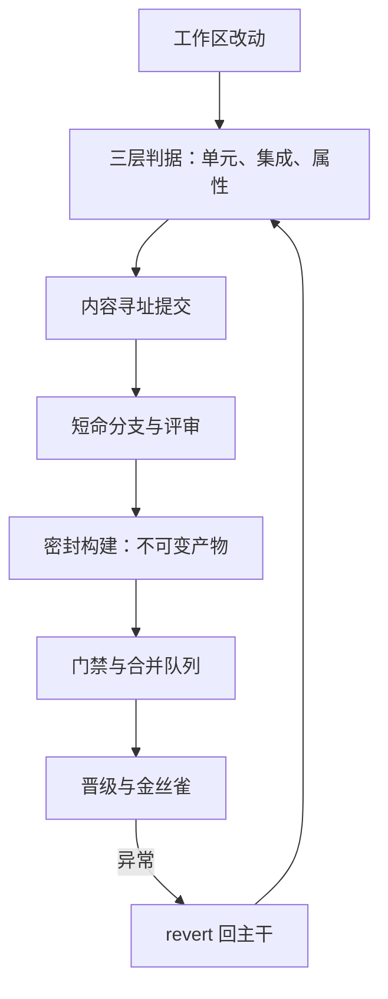

# 软件工程实践收束

五个环节不是五个工具，是同一条不变式切成的五段：任何时刻，主干上任何快照都能被验证、重建，并送进生产。

<footer>—— 据 Beck、Chacon-Straub 与交付工程实践整理</footer>

[上一课](/cs/swe-ci-cd)把三层判据、密封构建与产物晋级装成自动门禁，坏改动从合入前到生产中各有退路。本课程到此收束：把六课连成一条链，指出每两环交接处的不变式，并划出本课程没有覆盖的相邻地带。

## 问题

把五环节当五个独立工具学，错误全在接缝上：测试挂在没锁版本的依赖上，是测试与构建的缝；产物在每个环境重建，是构建与交付的缝；分支长命不归门禁管，是版本与分支的缝；门禁可以顺手跳过，是制度与制度的缝。收束课要回答的，就是这些缝在哪儿、靠什么焊住。

## 方法

走一遍链路。工作区改动先撞上本地判据：单元层毫秒级、属性层持续抽样（[测试策略：单元、集成与属性](/cs/swe-testing-strategy)）；提交把行为与判据一起冻进内容寻址的对象库（[git 的内部模型](/cs/swe-git-internals)）；短命分支与评审控制相遇成本（[分支与变更管理](/cs/swe-branching-changes)）；密封构建把快照变成键控的不可变产物（[构建系统：make 到 bazel](/cs/swe-build-systems)）；门禁与合并队列放行，产物逐环境晋级、金丝雀放量（[CI/CD](/cs/swe-ci-cd)）。回退不离开这条链：revert 生成反向提交，重建复用缓存，都是链上预留的边。

## 机制

链条抗腐烂的机理是每一环的失效都有上一环兜住：门禁漏掉的坏改动，由金丝雀与 revert 兜；构建漂移，由内容寻址的键兜；冲突积累，由短命分支兜；行为破坏，由三层判据与属性反例兜。链的强度由最弱一环决定，所以工程重点不是把某一环做到极致，而是让每一环的门禁都不可静默跳过——这是一条串联系统，[CI/CD](/cs/swe-ci-cd) 课的门禁经济学在链上处处适用。

交接处的不变式可数：判据挂变更集（测试与版本）、历史可回放（版本与分支）、快照可重建（分支与构建）、产物不可变（构建与交付）。审计一条流水线时逐条对这四句，缝在哪儿一目了然。

## 边界

本课程没有覆盖的相邻地带：需求与设计方法、流程与人员管理（敏捷仪式不展开）；安全工程与供应链攻击（[依赖混淆](/cs/dependency-confusion)、[SBOM 与可复现构建](/cs/sbom-reproducible-builds)）；线上的可观测与事件响应（[分布式追踪](/cs/distributed-tracing)、[事件响应](/cs/incident-response)）。本课程到此收束；深钻层的后续课程按树序继续。

## 小结

- 测试、版本、分支、构建、交付是一条链的五段，不变式是「主干随时可验证、可重建、可发布」。
- 判据挂变更集：提交里行为与判据同进同出，历史才能回放规格。
- 内容寻址贯穿两头：提交对象与构建产物都靠哈希获得身份与完整性。
- 门禁的价值在「没过门物理上走不下去」；跳过必须留痕。
- 回退是链上预留的边：revert、缓存重建、金丝雀回滚都是常态路径。
- 出处：Beck, *Test-Driven Development*, 2003；Meszaros, *xUnit Test Patterns*, 2007；Claessen and Hughes, *QuickCheck*, 2000；Chacon and Straub, *Pro Git*, 2nd ed., 2014。
