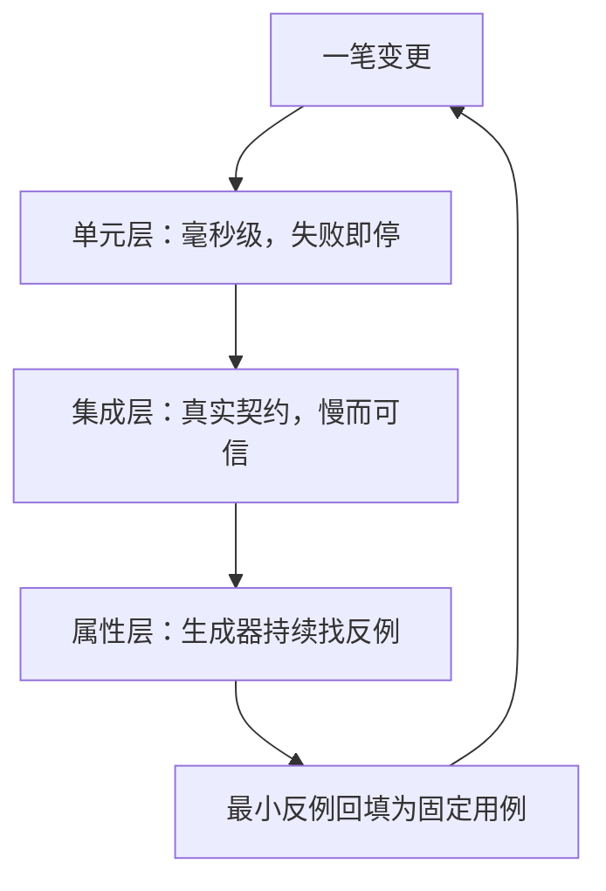
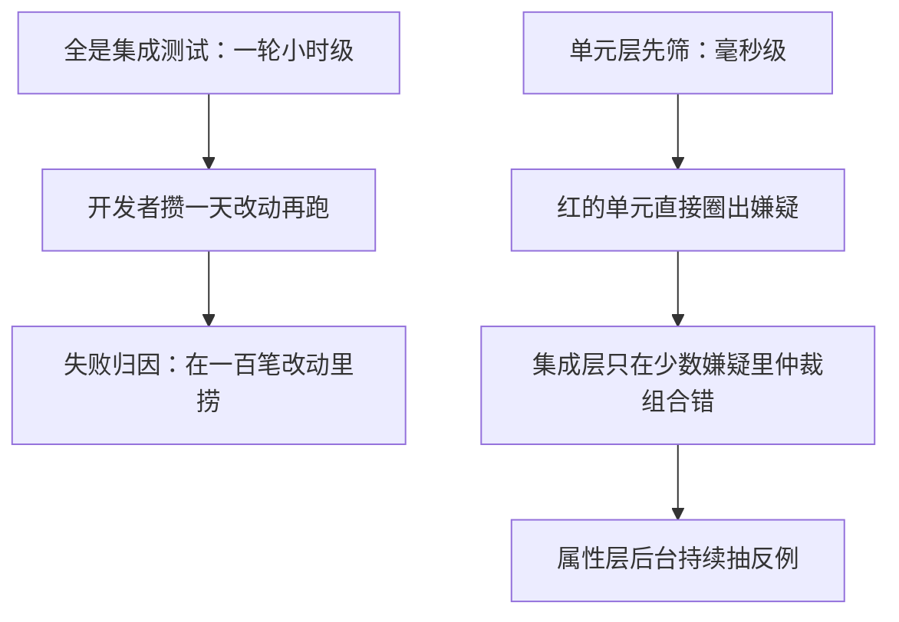

# 测试策略：单元、集成与属性

测试不证明程序正确，它只把「改坏了」的发现时刻从用户手里挪回开发者手里；挪得越早，定位越便宜。

<footer>—— 据 Beck, Test-Driven Development, 2003；Meszaros, xUnit Test Patterns, 2007 整理</footer>

[上一课](/cs/sc-case-map)给「数值与科学计算」收束：二次方程、方差、求和、softmax 四案各配一道改写——韦达换除法、Welford 增量、成对与补偿、减最大值——检查链从条件数走到工具链合同。数值正确性的判据钉完了，程序设计课末的[进程地址空间一览](/cs/process-addrspace-tour)与「从源到进程」的工具链单元——[预处理器](/cs/preprocessor-preview)、[调试器与断点](/cs/debugger-breakpoint)、[构建系统](/cs/build-system)——写的还是一个人怎样把源码变成进程。本课是「软件工程实践」的第一课，把镜头从单人换到持续变更的代码库：改动不断进来，每一笔都要有人回答「改对了没有」。答案不能靠重读全库，只能靠机器可执行的判据。后面的 git、构建与交付各课，都默认你已经会这三层判据与它们的失败次序。早先的[测试作为规格](/cs/test-as-spec)写过测试与规格的关系；本课写三层的分工。

## 问题

工具链单元留下的缺口在「变更」二字：调试器假设你已经知道去哪打断点，构建假设依赖图写全了，都不回答「这笔改动破坏了什么」。缺口是：把行为切成机器可判定的判据，使任何一笔改动在分钟内得到红或绿。判据按隔离程度分三层，成本与定位能力互为倒挂：隔离越彻底越快、失败越指得准，但替身出来的世界越不真实；越接近真实环境越可信，但越慢、失败越难归因。策略问题因此不是「选哪一层」，而是三层怎么配比、失败在哪层先停。

「判据」就是把『改对了没有』翻译成机器能自动回答的是/非题。人工 review 只能回答『看起来对不对』，回答不了『一千种输入下还对不对』——这正是三层判据存在的理由。

## 方法

单元层把被测对象与其依赖切开：文件系统、网络、时钟换成受控替身，单个测试毫秒级、彼此独立、可并行，失败即指向嫌疑最大的一处。TDD 把次序反过来：先写必然失败的测试，再写实现，红-绿-重构，让判据先于代码存在，而不是事后补一张「全绿」的证明。

集成层不再替身：真实数据库、真实进程间消息，验证接口契约。单元层各自绿、组合起来坏的语义冲突，只有这一层抓得住。代价是秒到分钟级、失败要靠日志归因，所以数量上要让单元层先筛。

属性层不写具体例子，写两条声明：输入怎么生成（生成器），任何合法输入必须满足什么不变量。引擎随机生成、遇反例缩小成最小反例。反转两次等于自身、序列化再反序列化等于原值，这类对全体输入成立的性质，手写例子覆盖不到的角落正是随机生成器的主场。

Claessen 与 Hughes 2000 年的 QuickCheck 论文把「生成器、不变量、缩小反例」三件套定成属性测试的骨架；shrink 把上千元素的随机失败压到两三个元素的最小反例，这一步的可诊断性是它与朴素随机测试的分界。

## 机制

分层有效的机理在反馈环时间决定行为。若全是集成测试，一轮全量小时级，开发者就攒一批改动再跑——失败归因从「一个测试」退化成「一百笔改动」。单元层把归因空间切小：红的单元直接圈出嫌疑；集成层只在单元层放行后的少数嫌疑里仲裁组合错误；属性层则持续抽样。三者不是重要性排序，而是响应速度排序：越快越多，越慢越少。

反馈环的账很好算：两百条单元测试五秒跑完，开发者愿意每保存一次就跑一轮；集成一轮四十分钟，就会攒到下班前才跑。等待时间一旦越过「泡杯咖啡」的量级，运行频率就断崖式下降——配比策略本质是在买运行频率。

测试是抽样，不是证明：属性层跑一百万个输入，也只是对输入分布的一百万次确认，找不到反例只提高置信度。证明属于形式化验证；把「全绿」读成「正确」，是测试策略里最贵的误读。

## 边界

覆盖率不是充分性：百分之百行覆盖可以零断言。替身过度会把测试锁在实现上而非行为上——替身越拟真、断言越细，重构越容易翻红，这是 Meszaros 替身谱系里专门的失败模式。属性测试的前提是想得出不变量；想不出时它退化为随机例子。并发与分布式一致性不归三层判据管（[Jepsen](/cs/jepsen-testing)）；对二进制与输入空间的随机化搜索是 fuzzing（[覆盖引导 fuzzing](/cs/coverage-guided-fuzzing)），同属「机器找反例」。

初学者容易把 100% 覆盖率当绿灯。行覆盖只回答「这行跑过没有」，不回答「结果对不对」——一行断言不写也能满覆盖。覆盖率适合当「哪里没测到」的探测器，不适合当「测够了」的证书。

## 小结

- 三层判据按隔离与真实性倒挂，策略是配比与失败次序，不是三选一。
- 单元层换依赖为替身，毫秒级、失败即定位；TDD 让判据先于实现存在。
- 集成层验证组合契约；单元各自绿不等于组合绿。
- 属性层写生成器与不变量，靠缩小反例把随机失败变成可读的最小反例。
- 测试是抽样不是证明；覆盖率、替身保真、并发行为各有边界。
- 出处：Beck, *Test-Driven Development*, 2003；Meszaros, *xUnit Test Patterns*, 2007；Claessen and Hughes, *QuickCheck*, 2000。
