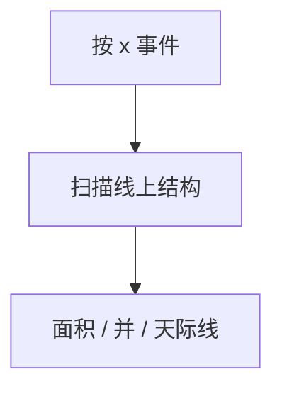

# 扫描线

竖线从左扫到右，在事件点更新有序结构；矩形面积并、交点、天际线都变成动态一维问题。

<footer>—— 据 Bentley and Wood, 1980；CLRS 第 33 章扫描思想整理</footer>

上一课[旋转卡壳](/cs/rotating-calipers)在凸包上转。扫描线是另一范式：按 $x$ 排序事件，维护与扫描线相交的状态。缺口是这套事件 + 平衡树/线段树。不重写凸包。后课最近点对也用分治或扫描。线段交 Bentley–Ottmann 后专课。

## 问题

矩形并面积：左右边事件，扫描线上按 $y$ 的覆盖次数线段树，每个 $\Delta x$ 乘当前覆盖长度。天际线、周长类似。扫描线与 $x$ 轴平行的假设：只在事件处拓扑变。

缺口是离散化 $y$ + 区间覆盖，不是卡壳。

### 不是平面扫描的全部

线段求交要处理交点也当事件（下一课的下一课）。本课先矩形、水平/竖直。斜线段要更完整的事件队列。

Bentley–Wood 矩形并。扫描线是计算几何标准。后课 Bentley–Ottmann 交点事件。

## 方法

事件排序。结构：多重集合、线段树、平衡树。惰性标记覆盖。离散坐标。

同一 $x$ 先入后出要定序。

## 机制

平移不变：两事件之间状态常数。把二维变一维动态。与扫描线做凸包（Graham 不是扫描线主形态）。与平面图平面扫描点名。

## 边界

本课不写完整 BO 交点。三维扫描不写。后课默认：矩形并/覆盖用扫描线 + 线段树。下一课最近点对。

## 小结

- 事件排序 + 线上动态结构。
- 矩形并是标准实例。
- 交点当事件留给 BO。
- 出处：Bentley and Wood, 1980；CLRS 第 33 章。
