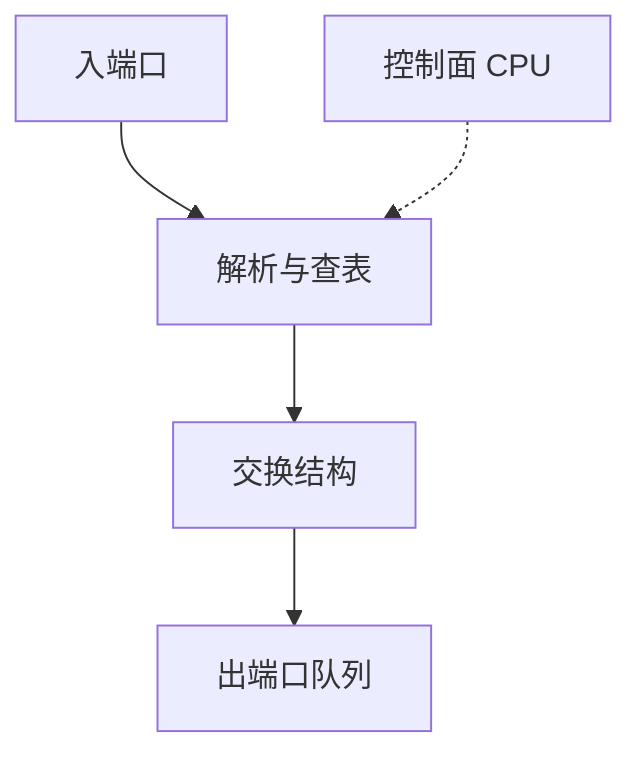

# 交换机架构与背板

线速转发要把所有口的峰值同时搬过一块交换结构；结构容量、内部阻塞与 CPU 慢路径决定「交换」是芯片还是总线。

<footer>—— 据 Karol, Hluchyj and Morgan, Input Versus Output Queueing, IEEE Trans. Commun. 1987；交换结构综述整理</footer>

[上一课](/cs/mac-learning)把转发说成查表出端口。缺口是**包如何从入端口内存走到出端口**：共享总线、共享内存、交叉开关、Clos 片上网络。本课不把队头阻塞定理写完，只点名结构。下一课专讲 HOL。

## 问题

$N$ 个口各 $R$ b/s，无阻塞结构需要约 $N R$ 的内部带宽（再加头税）。低端设备用 CPU 加软件桥（慢路径）；线速盒用 ASIC：解析 → 查 MAC/ACL → 过 fabric → 出口队列。控制面（STP、LLDP、LACP）上送 CPU，与数据面分离。过订购（oversubscription）把结构做得小于 $N R$，瞬时全口对打会丢——这是产品规格，不是 MAC 学习失败。

「背板带宽」常被营销加总双向。看无阻塞与否要比看一个更大的数字重要。本课不点名具体型号。

### 线速是结构承诺

过订购会在内部丢，不是学习失败。控制面 CPU 处理慢协议，数据面 ASIC 走热路径。背板营销数字要问是否无阻塞。

## 方法

对照三种：共享总线（一时刻一帧）、共享内存（写中央、读出口）、交叉开关（VOQ 对付 HOL）。画包路径：PHY → MAC → 入队/解析 → fabric → 出队 → PHY。PFC 阈值设在这些队列上。

方法止于选定对象与对照；机制才说它如何嵌入已有分层与主干课。

## 机制

速率演进加 lane，结构必须跟上。LACP 哈希在入或出完成，结构仍看到多个物理口或已聚合的逻辑带宽。巨帧占用结构更长时间，小包 PPS 打满查表。主干分层：结构不改以太网语义，只决定能否线速实现语义。

慢路径：未知控制协议、异常 TTL 不算这里（那是路由器），二层盒上送 BPDU/LLDP。

## 边界

本课不引入芯片内部的 replay 缓冲细节。输出排队与 HOL 是下一课。后课默认：线速 = 结构与查表匹配口速；过订购会在内部丢。

不要把「交换机很智能」写成应用层负载均衡——那是后课 L4/L7。

上一课留下的缺口在本课收口；「交换机架构与背板」进入后课词汇表后只引用。文献用来钉对象与边界，不把本课写成该主题的独立综述。下一课[输出排队与 HOL](/cs/output-queue-hol)。

## 小结

- 无阻塞结构带宽必须跟上 Σ 口速。
- 数据面 ASIC 与控制面 CPU 分工。
- 过订购表现为内部丢包。
- 后课只引用本课钉死的对象，不从该领域总问题重开。
- 出处：Karol et al., 1987；交换结构通识。
