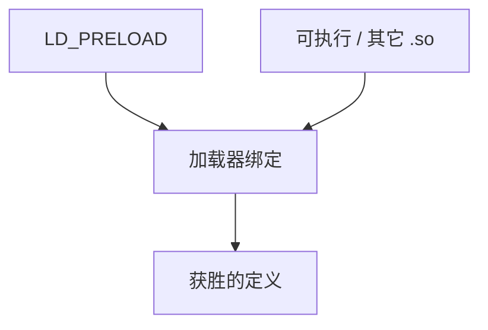

# 符号插入与 LD_PRELOAD

动态加载器按搜索序绑定符号：先出现的定义可插入（interpose）后来的。`LD_PRELOAD` 把用户库放到序首，用于包装 `malloc`，也能破坏意图。

<footer>—— 据 ELF 符号绑定与 `LD_PRELOAD` 手册；Drepper, How to Write Shared Libraries；Levine 整理</footer>

上一课[静态对动态](/cs/static-vs-dynamic-link) 选择了动态世界。缺口是**绑定次序**：插入、`RTLD_NEXT`、`visibility` 如何限制。本课钉加载器语义，不写利用教程；只讲编译器/链接为何发 `protected`/`hidden`。

## 问题

默认：全局符号可被预加载库覆盖。`malloc` 包装器靠此。代价：意外插入、ABI 劫持。链接器：`-Bsymbolic`、protected 可见性让引用绑到本 `.so` 内。缺口是**绑定范围**，不是 GOT 结构重画。

`dlsym(RTLD_NEXT, "malloc")` 找插入链上的下一个。

### 插入不是静态弱符号

弱符号是静态解析规则；插入是动态绑定。二者都「可被覆盖」，阶段不同。

Drepper 的 How to Write Shared Libraries。ld.so 手册。本课防御性：如何避免被插，以及合法包装。

## 方法

要包装：写 `.so`，`LD_PRELOAD=./wrap.so`。要防：`hidden` 内部函数、`-fno-semantic-interposition`（GCC/Clang 允许假设不被插，便于优化）。LTO 在动态库里仍可能因插入放弃一些 IPO。

与 PGO/LTO：若假设无插入，可内联跨导出函数——旗必须与部署一致。

## 机制

循环：包装器调用真 `malloc` 须 `RTLD_NEXT`，否则递归爆栈。不要在 `.so` 构造函数里调用尚可被插的符号而不小心。

安全：预加载可替换加密函数——部署环境要控制环境变量。点名即可。

## 边界

本课不提供恶意 hook 清单。后课默认：动态符号可被插入，除非可见性限制。下一课重定位类型：绑定最终怎么写进 GOT。

也不把 `LD_PRELOAD` 当容器编排课。

## 小结

- 动态绑定有序，PRELOAD 在前可插入。
- hidden/protected/symbolic 限制插入以恢复优化。
- 合法包装用 `RTLD_NEXT` 防递归。
- 出处：Drepper；ld.so；ELF；Levine。
