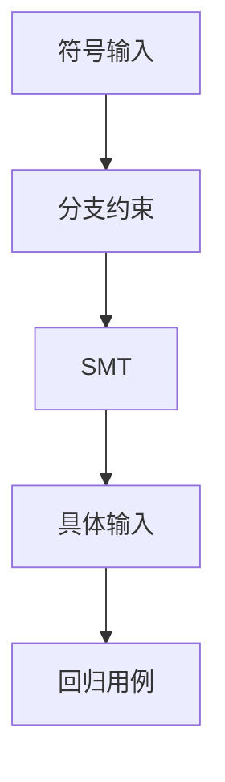

# 符号执行 KLEE

把输入当成符号，路径谓词交给 SMT，求解器吐出能走这条路径的具体字节。KLEE 在 LLVM 上这样找崩溃与断言失败；路径爆炸是它的税。

<footer>—— Cadar, Dunbar and Engler, KLEE, OSDI 2008；King, Symbolic Execution, 1976</footer>

## 定位

上一课[fuzz](/cs/coverage-guided-fuzzing)随机走。缺口是**精确满足分支条件**。主干[SMT](/cs/smt-solver)已有求解器。本课把符号执行接到测试生成，不重推 SMT。

后课默认已经读完本课钉下的合同，只补差，不从该领域第一性原理重开。

## 问题

fuzz 难猜 magic number。符号执行：每条分支加约束，`unsat` 则剪。缺口是循环与状态空间；混合（concolic）用具体跑加符号补。环境建模（系统调用）是工程。

### 不是证明无洞

没扫到的路径沉默。与 fuzz、审计互补。

King 1976；KLEE OSDI 2008。本课不把求解器当攻击工具教程。

## 方法

对照具体执行与符号状态。指出与覆盖 fuzz 混合：求解器解卡住的比较。下一课静态污点：不跑程序也追踪数据流。

图中节点是本课的机制骨架；课程不把图展开成可运行的攻击步骤。

## 机制

发现手段在「动态随机 / 动态符号 / 静态」之间权衡。下一课静态与污点分析。

前提写进合同之后，游戏外的误用只当失败模式点名，不在本课写成操作程序。

## 边界

本课不写破解某二进制保护的符号执行菜谱。静态污点下一课。

## 小结

- fuzz 不擅长 magic；符号执行解路径条件。
- KLEE 在 LLVM 上生成测试。
- 路径爆炸与环境是边界。
- 下一课静态与污点。
- 出处：Cadar, Dunbar and Engler, OSDI 2008；King, 1976。
