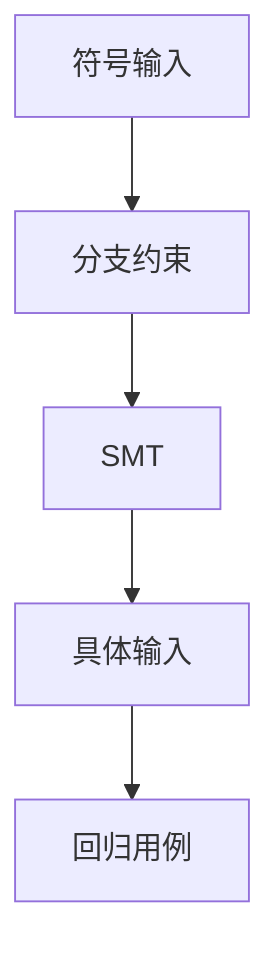
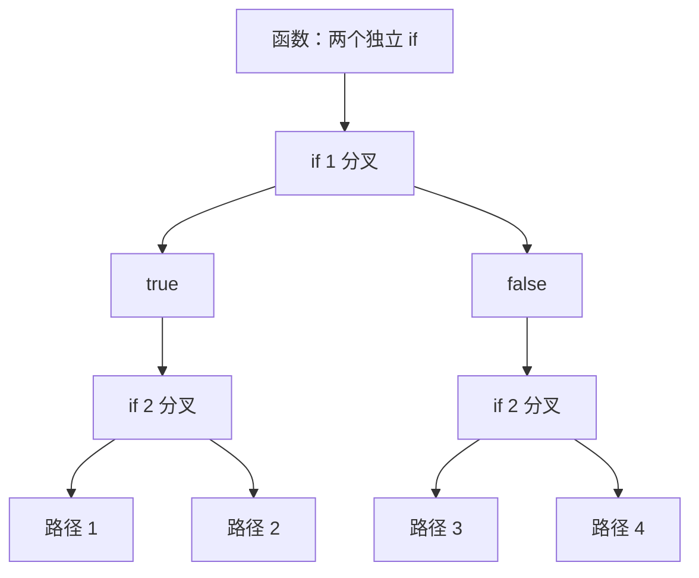

# 符号执行 KLEE

把输入当成符号，路径谓词交给 SMT，求解器吐出能走这条路径的具体字节。KLEE 在 LLVM 上这样找崩溃与断言失败；路径爆炸是它的税。

<footer>—— Cadar, Dunbar and Engler, KLEE, OSDI 2008；King, Symbolic Execution, 1976</footer>

上一课[fuzz](/cs/coverage-guided-fuzzing)随机走。缺口是**精确满足分支条件**。主干[SMT](/cs/smt-solver)已有求解器。本课把符号执行接到测试生成，不重推 SMT。

后课默认已经读完本课钉下的合同，只补差，不从该领域第一性原理重开。

## 问题

fuzz 难猜 magic number。符号执行：每条分支加约束，`unsat` 则剪。缺口是循环与状态空间；混合（concolic）用具体跑加符号补。环境建模（系统调用）是工程。

「magic number」就是藏在比较里的魔法常量，比如 if (x == 0x5A4D)。fuzz 靠瞎撞几乎猜不中 16 位十六进制；符号执行把它变成方程 x = 0x5A4D，求解器一步解出——这是两者的分水岭。

### 不是证明无洞

没扫到的路径沉默。与 fuzz、审计互补。

King 1976；KLEE OSDI 2008。本课不把求解器当攻击工具教程。

## 方法

对照具体执行与符号状态。指出与覆盖 fuzz 混合：求解器解卡住的比较。下一课静态污点：不跑程序也追踪数据流。

```mermaid
flowchart TD
  SYM["符号输入"] --> BR["分支约束"]
  BR --> SMT["SMT"]
  SMT --> IN["具体输入"]
  IN --> TEST["回归用例"]
```

## 机制

发现手段在「动态随机 / 动态符号 / 静态」之间权衡。下一课静态与污点分析。

```mermaid
flowchart TD
  F["函数：两个独立 if"] --> I1["if 1 分叉"]
  I1 --> T1["true"]
  I1 --> F1["false"]
  T1 --> I2["if 2 分叉"]
  F1 --> I3["if 2 分叉"]
  I2 --> P1["路径 1"]
  I2 --> P2["路径 2"]
  I3 --> P3["路径 3"]
  I3 --> P4["路径 4"]
```

路径数按指数长：20 个独立判断就是 2 的 20 次方，约 105 万条路径；50 个判断已超过千万亿。「循环与状态空间」的税在工程上必须靠剪枝、合并与限深来压，否则求解器先饿死。

## 边界

本课不写破解某二进制保护的符号执行菜谱。静态污点下一课。

常见误区：把「KLEE 跑完没报错」当成「程序没有漏洞」。它只保证扫过的路径在求解精度内无反例；没走到的路径（尤其依赖外部环境的那部分）保持沉默——这正是它与 fuzz、人工审计互补的原因。

## 小结

- fuzz 不擅长 magic；符号执行解路径条件。
- KLEE 在 LLVM 上生成测试。
- 路径爆炸与环境是边界。
- 下一课静态与污点。
- 出处：Cadar, Dunbar and Engler, OSDI 2008；King, 1976。
