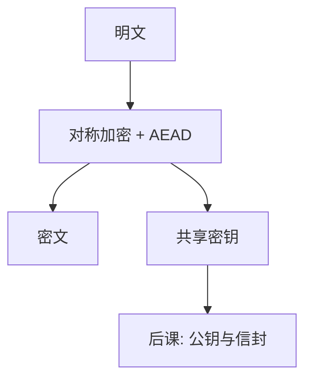

# 对称加密够用的那一层

收发双方持同一密钥；保密来自密文对未知密钥不可区分，不来自把算法藏起来。

<footer>—— 据 Shannon, Communication Theory of Secrecy Systems, 1949；Goldwasser and Micali 对语义安全的命名</footer>

[上一课](/cs/dolev-yao)要求先写敌手。本课不重画信任边界。缺口是：在「敌手能看密文、不知道密钥」的模型下，如何让明文的 CIA 中的 C 成立。对称加密：加密与解密用同一密钥。本课只收到「语义安全 + 工作模式」这一层，不把 AES 圈数当课程。

## 问题

[比特](/cs/bit-as-distinction)已经能编码消息。明文当文件存、当套接字发出，旁路全看见。缺口是共享密钥下的变换：密文泄漏应可忽略（在密钥未知时）。Shannon 1949 给出完善保密的极限（一次一密）；实践用计算安全：敌手多项式时间，AES 一类分组密码加模式。

ECB 把相同明文块映成相同密文块，泄漏重复模式。CBC/CTR/AEAD 才是「够用的那一层」该记住的：要随机 IV/nonce，且应带完整性——纯加密不防篡改。

## 方法

分组密码提供伪随机置换；模式把它扩到任意长度。AEAD（如 AES-GCM）同时给保密与完整性，避免「先加密再 MAC」接错顺序。密钥长度与分组大小是资源：太短被穷举，nonce 重用在 CTR/GCM 下是灾难性误用，不是算法被「破解」。

## 机制

保密依赖密钥未泄露与 nonce 不重复。完整依赖 AEAD 或 Encrypt-then-MAC，使主动改密文以高概率失败。这服务威胁模型里的链路窃听者与改包者，不服务「已拿到密钥」或「能读内存」。密钥如何第一次送到对方，对称方案回答不了——那是公钥课的信封。

IV/nonce 不是密钥，却必须不重复；重复在 GCM 下会同时伤保密与完整。

## 边界

不要把对称加密写成「数据库加密列」的全部：列上确定性加密会泄漏相等性，与独立假设无关，是模式选择问题。也不引入同态、搜索加密。量子对对称的影响主要是密钥加长，本课不展开。

密钥必须可轮换：泄露后的窗口由轮换频率决定，不是由 AES 圈数决定。后课默认：谈到会话保密，默认 AEAD 对称；密钥如何协商与封装，用公钥。

密钥生命周期（生成、封装、使用、销毁、轮换）与算法同样属于这一层。本课只点名，细节落在协议与运维。

## 小结
- 完整性要 AEAD 或 Encrypt-then-MAC；先加密后裸发密文挡不住改包。
- 后课公钥只运 $k$，不改大批数据仍走对称这一事实。

- 威胁模型已在；对称层用共享密钥提供计算上的保密，AEAD 兼完整。
- 纯加密不认证；nonce 误用比「算法过时」更常见。
- 密钥分发与信封是后课缺口。
- 出处：Shannon, 1949；Goldwasser and Micali（语义安全的名字）；Stallings。
