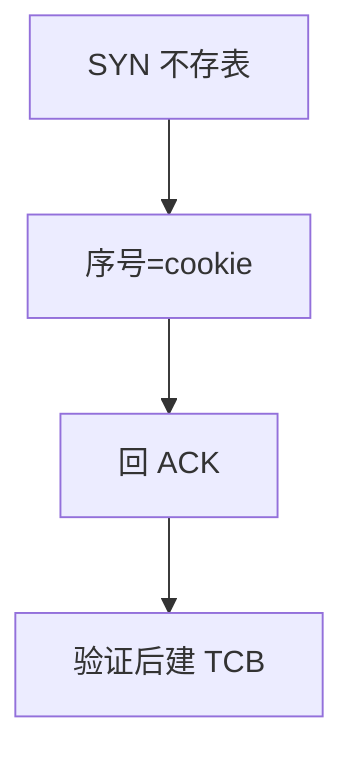

# SYN cookies

不把半开连接存进队列，而把状态编码进 SYN-ACK 的序号；ACK 回来再重建。抗泛洪，但可能丢掉选项。

<footer>—— 据 Bernstein 的 SYN cookies 笔记；RFC 4987 TCP SYN Flooding 整理</footer>

[上一课](/cs/tcp-state-machine) 的 SYN-RECEIVED 要占 TCB。[握手](/cs/tcp-handshake) 假定队列够。缺口是 **SYN flood**：伪造源填满半开。cookies 用密码学或哈希把 MSS 等塞进 seq。本课不把 keepalive 写完。

## 问题

攻击者发大量 SYN，源不可达，队列满则合法 SYN 被拒——可用性。Cookie：SYN-ACK 的初始序号 = 哈希(密钥, 四元组, 时间, MSS 编码)，不存 TCB。最终 ACK 校验哈希再创建 ESTABLISHED。代价：时间戳/SACK/缩放可能无法从 32 位里恢复，长肥管道受害者。只在队列压力下启用是常见政策。

不要把 cookie 写成 TLS cookie 或 QUIC retry 的拷贝，对象类似、编码不同。

RFC 4987 描述攻击与对策。Linux 实现细节不背。密钥要轮换。

### 半开搬进序号

抗泛洪，可能丢掉缩放等选项。任播要同一密钥验证。压力下启用是常见政策，永久开启要接受降级。

## 方法

对照：存 TCB vs 编码进序号。画：SYN → cookie SYN-ACK → ACK 验证 → 建连。与 RPKI 对照：都是用密码学/哈希抗伪造，一层在路由，一层在传输。

方法止于选定对象与对照；机制才说它如何嵌入已有分层与主干课。

## 机制

AIMD 尚未开始，cookies 在握手。MSS 钳制仍可发生在 SYN 上。Anycast 与 ECMP：ACK 必须回到能验证同一密钥的实例，否则失败——接住拓扑课。卫星长 RTT 使 cookie 时间窗要宽容。

合法瞬时高峰也会触发 cookies，表现为偶发无窗口缩放。

## 边界

本课不引入 SYNPROXY 的全部。保活与半开是下一课。后课默认：压力下用 cookie 抗泛洪；选项可能丢。

把 cookies 当默认永久开启要接受功能降级。

上一课留下的缺口在本课收口；「SYN cookies」进入后课词汇表后只引用。文献用来钉对象与边界，不把本课写成该主题的独立综述。下一课[保活与半开](/cs/keepalive-half-open)。

## 小结

- 半开状态搬进 SYN-ACK 序号。
- 抗 SYN 泛洪，可能丢 TCP 选项。
- 验证要密钥与时间窗，任播要同源。
- 后课只引用本课钉死的对象，不从该领域总问题重开。
- 出处：RFC 4987；Bernstein cookies。
