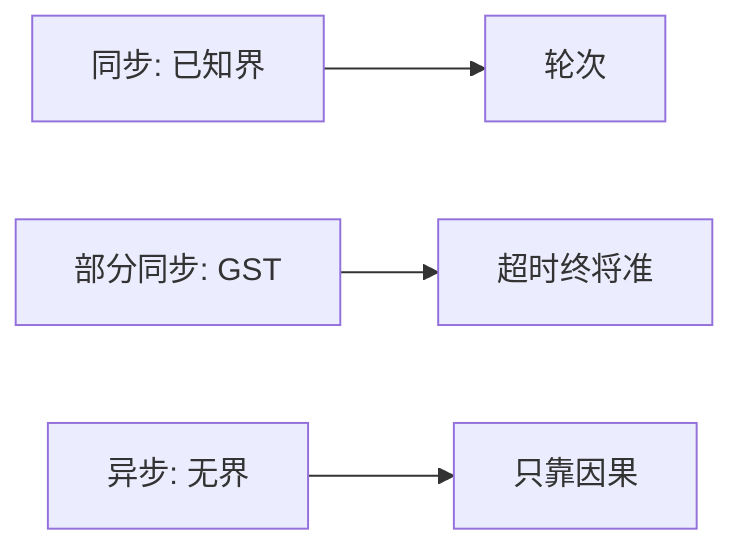

# 同步与异步系统

同步假定步与消息延迟有已知上界；异步没有。部分同步把「终将稳定」写进模型，让超时有朝一日合法。

<footer>—— 据 Dwork, Lynch and Stockmeyer, Consensus in the Presence of Partial Synchrony, JACM 1988；Lynch, Distributed Algorithms 整理</footer>

上一课[故障模型](/cs/failure-models)钉了进程会怎样偏离。缺口是**时间**：同样崩溃停，同步里可以用轮次与超时当证据，异步里超时什么也证明不了。本课不重写故障类。后课时钟、检测器、FLP 都相对本课的三档时间模型说话。

## 问题

同步系统：处理一步、信道延迟都有已知上界 $\Delta$。可以做同步轮：等 $\Delta$ 收齐本轮消息再进入下一轮。异步系统：有限延迟但无上界，调度器可以无限推迟某条消息或某步。缺口不是「网络快不快」，而是算法能不能把「没收到」读成「对方故障」。

完全异步加上哪怕一个崩溃，确定性共识不可能——那是后课 FLP。本课先把模型立住，否则 FLP 像空降的悖论。

部分同步（Dwork–Lynch–Stockmeyer）：存在未知的全局稳定时刻 GST，之后延迟不超过未知上界。GST 之前可以任意异步。超时终将正确，但你不知道从哪一轮开始。

DLS 1988 给出几种部分同步变体（未知界、终有界）。实践中的「大多数时候同步」是工程口吻，证明里仍要用 GST 或未知 $\Delta$。

## 方法

写协议时显式选一档：

- 同步：轮次算法、同步拜占庭、锁步检查点合法。
- 异步：只用因果与计数，不用「等 100ms 当死」。
- 部分同步：用超时驱动选举，正确性不依赖超时值，活性依赖终将同步。

物理时钟下一课才引入；本课的「时间」是调度与延迟上界，不是 NTP。

## 机制

同步降低故障检测难度：过了 $\Delta$ 没到就是漏发或崩溃。异步把漏发与「还在路上」叠成同一观察，于是需要故障检测器抽象（后课）把怀疑从算法里抠出来。部分同步是 Raft、Paxos 活下来的常用假设：安全性在异步下也要成立，领导者选举与心跳只为活性。

未知界与 GST 的差别：前者永远有某个 $\Delta$ 但算法不知；后者有一段时间完全无界。实现上都表现为「超时要可调、要退避」，但规格上不要把二者混成「网络抖动」。

本课不把操作系统的实时调度、CPU 中断延迟写成分布式同步：那些是单机界，进不了消息上界，除非你把整条路径的最坏延迟都证出来——数据中心通常证不出来。

## 边界

本课不证共识下界，不引入逻辑时钟。不把「同步复制」数据库术语当成 DLS 同步。后课默认：正确性先按异步证明，活性再声明部分同步；只有明确的同步模型才允许「超时即故障」写进安全性质。

三档时间模型与上一课故障类正交：同步拜占庭与异步崩溃是不同的格子。后课填格子，不改格子的轴。

## 小结

- 同步有已知延迟界；异步没有；部分同步有 GST。
- 安全常要求异步下也成立；活常用超时，依赖部分同步。
- 超时不是异步模型里的原语。
- 出处：Dwork, Lynch and Stockmeyer, JACM 1988；Lynch 教材。
