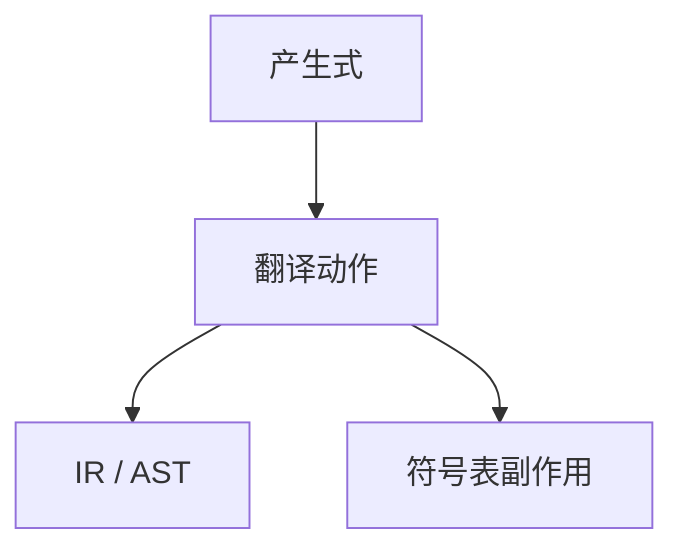

# 语法制导翻译

归约（或下降）走到产生式，就执行翻译方案：建结点、查表、或发出中间代码。语法驱动控制流，语义在动作里。

<footer>—— 据龙书第 5 章语法制导翻译；Aho and Ullman 的翻译方案传统整理</footer>

上一课[属性文法](/cs/attribute-grammar)给出方程。缺口是编译器里那份**可执行的方案**：语法制导翻译（SDT）把方程编成与产生式绑定的代码片段。主干[三地址](/cs/ir-three-address)是动作的目标之一。本课钉「何时发代码、值存在哪」，不重开 SSA。

## 问题

属性方程是数学；SDT 是实现：`E → E1 + T { emit(add); E.addr = newtemp(); }`。自底向上：动作在右部末尾最自然（S 属性）。要在右部中间用继承值，须改写成标记非终结符或先建树再走第二遍。缺口是**动作放置**，不是再定义加号语义。

与访问者：先完整 AST 再翻译，等于把 SDT 从分析期推迟。两种都合法；生成器习惯分析期动作，手写前端习惯后遍。

### `emit` 不是优化

此处发出的是忠实 IR。常量折叠可在动作里做，但那是优化课的对象；本课只要求结构对应。不要在 SDT 里做寄存器分配。

龙书把 SDT 与 AG 放在同章。Appel 的教材偏向先树后 IR。本进阶课二者都认：生成器路径 vs 显式 AST 路径。

## 方法

选定 IR（三地址、树 IR）。为每个产生式写动作：叶结点从 `yylval` 取值；内部结点综合地址或树指针。控制流：`if` 产生式留下回填洞，或生成带标号的跳转——与后课中端 CFG 衔接，本课只发指令序列。

错误节点：动作应跳过或发 trap，不要当合法加号去折叠。接[错误恢复](/cs/parse-error-recovery)。

## 机制

左递归产生式的 SDT 自然得到左结合的代码序。右递归则反向，要小心临时值寿命。继承属性在 LR 里常用语义栈上的「已分析兄长」。

宏展开若发生在 SDT 之前，动作看见的已是展开后记号——本课序后段宏课再钉顺序。

## 边界

本课不写指令选择，不引入 φ。后课默认：前端可用 SDT 得到 AST 或线性 IR。下一课：宏——在记号或树上做的另一类「翻译」，卫生问题从这里露出。

不要把 SDT 当成类型健全性证明；类型规则下一单元。

## 小结

- SDT：产生式绑定动作，驱动翻译。
- S 属性可在 LR 归约时执行；更复杂就先树后遍。
- 动作发 IR，不做分配与调度。
- 出处：Aho et al., 龙书第 5 章；对照 Appel 的树转 IR。
