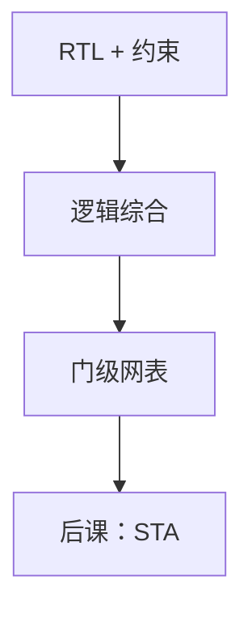

# 综合与网表

  
综合把 RTL 的并行行为映射成标准单元或 LUT 的连接：算术变成门，`posedge` 变成触发器，不可综合的延迟与打印被丢掉。

  <footer>—— 据 Harris and Harris, Digital Design and Computer Architecture；IEEE Std 1364.1（RTL 综合子集）整理</footer>

[上一课](/cs/blocking-nonblocking)让仿真与预期硬件对齐。缺口是工具链的下一步：**逻辑综合**——读 RTL 与约束，写出门级网表（Verilog 仍可当交换格式，里面是 `AND2`、`DFF` 例化）。

## 问题

`assign y = a + b;` 在 RTL 是行为。综合器在库里选行波或 CLA 结构、插入缓冲、做逻辑优化（与[卡诺图](/cs/karnaugh-map)同一布尔目标，规模大得多）。缺口不是再讲阻塞赋值，而是：哪些构造被认作组合/时序，哪些被忽略（`#5`、`initial $display`）。网表是实例与网的表，不再有 `always` 调度。

约束：时钟周期、输入延迟、假路径。没有周期约束，工具不知该用快单元还是省面积——与[加法器延迟](/cs/adder-cla)的手工权衡同一问题，改由工具做。

### 综合不是「保证等价于所有仿真行为」

语言里可写出综合器不支持或会改语义的结构（如敏感列表不全的 `always`）。后课形式等价检查才在 RTL 与网表之间建证明。本课承认：综合是带约束的翻译，不是整语言的解释器。

IEEE 1364.1 尝试定义可综合子集。Harris 展示 RTL→门。厂商综合器（Design Compiler、Vivado 等）实现细节不同，本课钉流程角色。

## 方法

输入：RTL、工艺库或 FPGA 器件、SDC 一类约束。输出：网表 + 初步时序/面积报告。算术推断：`*` 可能映射到 FPGA DSP 或 ASIC 乘法器生成器，对应上一单元的树，但结构由工具选。FSM 从 `case` 状态编码推出。

扫描链、时钟门控可在综合插入，后课 DFT 与功耗再展开。本课只看到「功能网表」。

## 机制

静态时序分析吃的是这张网表加延迟模型。布局布线之后延迟会变，需要再综合或物理优化——后课 FPGA/ASIC 流程。本课把网表定义为综合与 STA 之间的合同。

## 边界

本课不教某 GUI 的按钮，不把高级综合 C++ 当 RTL（那是 HLS 课）。不发明网表格式标准号。晶体管级 SPICE 不在数字综合输出里。

后课默认：可综合 RTL 变成门与 FF 的网表；延迟数字交给 STA，不在仿真 `#delay` 里。

## 小结

- 综合：RTL+约束 → 标准单元/LUT 网表。
- 不可综合构造被丢或拒；`+`/`*` 的结构由工具推断。
- 下一课用 STA 检查这张网是否满足周期。
- 出处：Harris and Harris；IEEE 1364.1。
