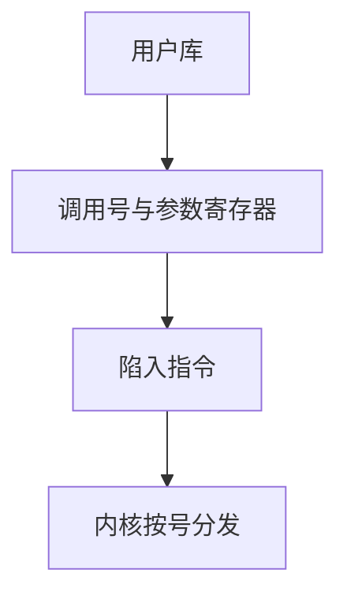

# 系统调用 ABI

系统调用号、参数寄存器与返回值约定一旦钉死，用户库与内核才能各自演进而不把对方拆掉。

<footer>—— 据 Tanenbaum and Bos, Modern Operating Systems；Love, Linux Kernel Development 整理</footer>

[上一课](/cs/kernel-user)命名了门：用户只能陷入，不能跳进内核任意地址。[特权级](/cs/privilege-rings)禁止用户执行特权指令。[调用约定](/cs/calling-convention-stack)只覆盖 `jal` 那一套。缺口是：陷入时**哪一个寄存器是调用号、参数放哪、错误怎么回来**——这是系统调用 ABI，还不是整条内核路径。

## 问题

若每个程序自己发明「`a0` 里是路径字符串」，内核无法分发。硬件只保证切特权、跳到[异常入口](/cs/exception-interrupt-entry)；软件必须再约定：调用号、至多若干个寄存器参数、返回值与错误码的编码。缺口不是再讲环，而是把普通过程 ABI 换成**跨特权的那一张表**。

本课不列出 Linux 的全部调用号，也不把 `ioctl` 的设备语义写完。

libc 的 `read` 仍是用户函数；真正遵守本课约定的是最里一层陷入指令。POSIX 是接口名，ABI 是寄存器与编号。

## 方法

用户：把调用号放入约定寄存器（或立即数槽），参数按序放入其余约定位置，执行陷入指令。内核入口：按号查表，从那些寄存器读参数。成功则返回值在约定寄存器；失败则把错误码放进约定位置（或负值约定），用户库再译成 `errno`。

同一套 ABI 对所有自愿服务有效：后课的 `fork`、`mmap` 只是表上的不同号。本课只钉约定，不走拷贝与阻塞。

## 机制

ABI 把「请内核办事」收成可版本化的合同。用户永远不持有内核函数地址；它只持有编号。换内核实现不必重编用户程序，只要编号与寄存器槽不变。这与普通 `call` 不同：目标不在用户可写的 GOT 里。

参数仍可能是用户指针。ABI 只说「指针值在哪个寄存器」；指针指向的页是否可读、要不要拷贝，是[系统调用路径](/cs/syscall-path)之后、下一课之前仍未展开的缺口——本课不提前做 `copy_from_user`。

## 边界

本课不对比 `int 0x80`、`syscall`、`svc` 的编码字节，不把 seccomp 写成安全课。也不讨论把读时钟留在用户态：那是下一课 vDSO，不改变「改内核状态必须遵守本课 ABI 并陷入」。

调用号空间与 libc 版本绑定；兼容层是发行策略，不是另一套操作系统课。

后课默认：用户要服务，先按 ABI 填号与参数。有些只读查询能否免一次陷入，下一课讲 vDSO。

## 小结

- 系统调用 ABI：调用号、参数槽、返回值与错误约定。
- 用户只持有编号，不持有内核指令指针。
- 指针参数的安全拷贝仍未给出。
- 出处：Tanenbaum and Bos, *MOS*；Love, *Linux Kernel Development*。
