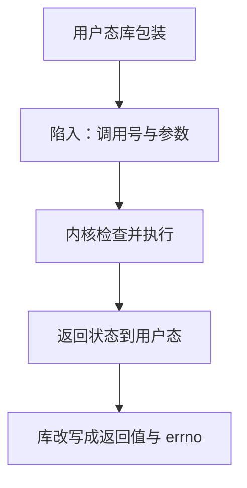

# 系统调用作为边界

用户代码不能直接操作内核对象；它把编号与参数放进约定位置，陷入内核，由内核决定是否执行并返回状态。

<footer>—— 据 Bryant and O'Hallaron, Computer Systems: A Programmer's Perspective；ISO/IEC 9899 整理</footer>

上一课[动态链接直觉](/cs/dynamic-link-preview)把库代码映进同一地址空间。本课不重讲 GOT，也不从操作系统调度另起。缺口是：`malloc`、`read`、打开文件看起来像函数，**有些必须请求内核，因为页表、文件与进程不是用户态能改的对象**。系统调用是本栏里第一道硬件协助的保护边界。

## 问题

用户态与内核态用处理器模式位分开。普通 `call` 进共享库仍是用户态；真正改内核状态要走陷阱：系统调用指令或旧的中断门，带上调用号与参数。缺口因此不是「Linux 有哪些 syscall」，而是**失败与成功都经过这条边界**：返回值编码错误，参数里的用户指针要由内核在核内再验证。错误码课的模式在这里变成硬件强制——你无法「忽略模式位」去写磁盘。

C 库包装把陷阱藏进普通函数。本课要看见包装后面的陷入，否则后课进程、文件、网络都会被误认成「又一个库」。ISO C 的 `fopen` 是标准库；底下是否系统调用由实现决定，但在有内核的主机上，最终会碰到本课这条边界。

### 系统调用不是普通间接调用

虚表与 PLT 仍在同一特权级里跳转。系统调用切换特权、改页表可见性、让内核用自己的栈。返回时可能伴随信号、被调度到别的线程——那些是后课。本课只钉：控制与数据穿过特权边界，参数按另一套 ABI（系统调用约定）放置，不必与用户函数的调用约定相同。

CSAPP 用陷入、异常与系统调用来解释用户/内核交接。ISO C 把宿主环境里的输入输出定义为库；本栏把「必须特权」的那一层单独点名，以免组成课之前完全看不见内核。

## 方法

用户把调用号与参数写入寄存器（或栈，视 ABI），执行陷入指令。内核根据编号分派，检查指针是否指向用户可访问页，执行或拒绝，把状态写回约定寄存器，再返回用户态。C 库把负错误码转成 `-1` 加 `errno`。阻塞的调用在核内等待，用户栈帧仍按调用约定活着——从源码看像一次很慢的函数。

不是每个库函数都陷入：纯计算的 `strlen` 不必。边界在「是否需要内核对象」，不在函数名字是否像系统词。

不是所有失败都来自内核：库可以在陷入前因参数非法直接返回。调用方仍只看见错误码。追踪真正陷入要用专门的跟踪器看调用号，调试器在包装函数下断只能看见用户态。这与第一课「不要把编译当黑盒」同类：包装是又一层翻译。后课地址空间解释用户指针：内核按用户页表去拷贝，失败返回 `EFAULT`，这是合法错误，不是 UB——用户程序传坏指针给系统调用，通常得到错误码而不是被标准宣布无语义。语言 UB 与内核错误要分开。

## 机制

特权分开让崩溃的用户指针不能任意改内核；内核仍必须自己写对检查，否则恶意参数可以让核去解引用坏地址。这是封装在硬件上的对应：表示（页表、打开文件表）用户看不见完整布局，只能通过编号过的操作入口修改。后课组成会从门电路解释模式位如何挡住普通访存；本课只要程序员模型：想做被禁止的事，必须请求。

包装函数可以在陷入前做用户态缓冲（stdio），于是一次 `fprintf` 不一定对应一次 `write`。契约因此有两层：C 库的后置，与内核调用的后置。短写、`EINTR`、非阻塞返回是内核层的部分成功，库可能再循环，也可能暴露给调用方。本课只要程序员能指出「特权在哪一层切换」。后课地址空间会说明为何内核必须检查用户指针：那份地址只在用户地图上有意义，内核若直接解引用，用的是另一张页表。封装在硬件上的对应，就是这张检查。

## 边界

本课不讲调度器、不讲具体调用号表、不把微内核 IPC 展开。下一课[进程地址空间一览](/cs/process-addrspace-tour)画出用户指针合法的那张地图。后课默认：改内核对象要陷入；C 库包装不是特权本身；系统调用约定可以不同于函数 ABI。

## 小结

- 系统调用用陷入穿过用户/内核边界，编号与参数走专用约定。
- 库函数可能包装陷阱，也可能纯用户态；特权不由名字决定。
- 用户指针由内核再验证；错误回到返回值与 `errno`。
- 下一课画出这些用户指针所在的地址空间。
- 出处：CSAPP 异常控制流；ISO C 宿主库与本栏的特权分层。
