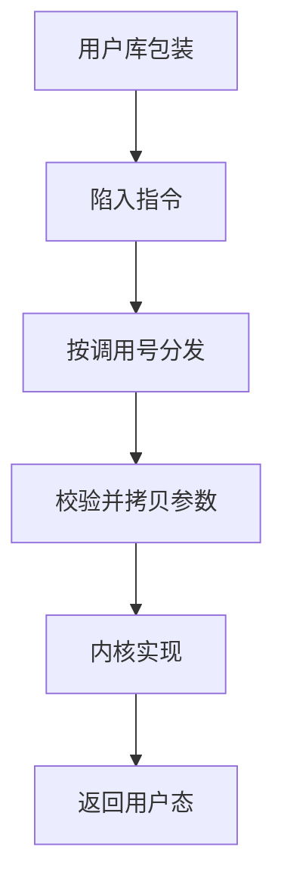

# 系统调用路径

系统调用把用户程序连到操作系统；它看起来像普通过程调用，实际经过陷入与参数校验。

<footer>—— 据 Tanenbaum and Bos, Modern Operating Systems 整理</footer>

[上一课](/cs/trapframe)让内核能在线程之间换上下文。[特权级](/cs/privilege-rings)禁止用户直接碰设备。[内核与用户态](/cs/kernel-user)只命名了门。缺口是：用户要读文件、要 `wait`，必须走一条**自愿陷入**的固定路径，而不能跳进内核任意地址。本课只钉这条路径。

## 问题

若把内核函数地址当普通 `call` 目标，用户可以带着任意栈进去，校验全无。硬件因此提供陷入指令：切特权、跳到唯一入口（或一小张入口表），把系统调用号放在约定寄存器里。缺口不是新的上下文格式，而是从用户 ABI 到内核实现函数的那一段：编号、拷贝参数、执行、写回返回值、再按[异常入口](/cs/exception-interrupt-entry)返回。

本课不把每个 Unix 调用列成表，也不讲 `ioctl` 的全部设备语义。

libc 把 `read` 写成用户函数；真正的陷入在最里一层。POSIX 是接口，陷入指令是实现。

## 方法

用户：把调用号与参数放入约定位置，执行陷入。内核入口：保存状态（可与切换共用帧），按号跳到实现，从用户地址空间**拷贝**入参（不能信任用户指针一直有效），执行，把返回值或 `errno` 写回，再 `sret`/`iret`。若调用要阻塞，入口路径会走进上一课的切换，醒来后从同一路径返回。

## 机制

路径把「请求服务」从「执行内核代码」里隔开：用户永远不持有内核指令指针。参数拷贝是因为[分页](/cs/paging-vm)下用户指针可能缺页或指向内核；内核必须用自己的映射安全地读。返回时特权降回用户，PC 指向陷入指令的下一条。

同一条路径既服务文件，也服务后课的 `clone`、`mmap`、套接字。本课只要求：凡跨特权的请求，都长这样。设备完成则往往先走中断，再唤醒阻塞在系统调用上的线程——那是下一课下半部。

## 边界

本课不对比 `int 0x80`、`syscall`、`svc` 的编码，不把 seccomp 与能力模型写成安全课。也不讨论 VDSO 把部分读时钟留在用户态：那是加速，不改变「改内核状态必须陷入」。

调用号空间是 ABI 的一部分，与 libc 版本绑定；本课不把兼容层写成另一操作系统。

后课默认：用户要内核做事，就走系统调用路径；阻塞调用会切换。设备如何在路径之外把 CPU 抢回去，下一课讲中断下半部。

## 小结

- 系统调用是自愿陷入：编号、校验拷贝、执行、返回。
- 用户指针不可信；内核用自己的映射读入参。
- 阻塞会触发上下文切换；异步设备完成靠下一课。
- 出处：Tanenbaum and Bos, *MOS*；Silberschatz et al., *OSC*。
