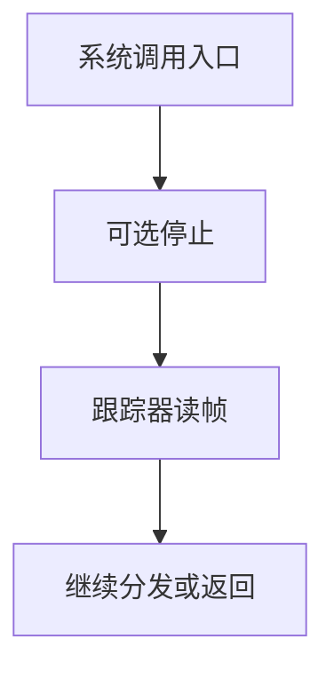

# 跟踪与 ptrace 入口

跟踪器不是第三套特权：它只是在系统调用与信号边界上，经内核同意停下被跟踪进程并窥视其 trapframe。

<footer>—— 据 Love, Linux Kernel Development；Tanenbaum MOS 整理</footer>

[上一课](/cs/restart-syscall)让返回用户前可能改 PC 以重启调用。[trapframe](/cs/trapframe)里已经有完整用户寄存器。缺口是：调试器、`strace` 一类工具要在**进入/离开系统调用**时停下目标进程、读参数、可选地改返回值。本课只钉这条跟踪入口，不当成调试器产品课。

## 问题

若跟踪器直接改目标内核栈，会破坏[内核与用户态](/cs/kernel-user)的门。正确做法是目标在路径边界停进跟踪态，内核把事件报告给跟踪器进程；跟踪器再用专门系统调用读、写目标的帧与内存（仍走拷贝与校验）。缺口不是新的 ABI 编号哲学，而是在[系统调用路径](/cs/syscall-path)上插入**可阻塞的观察点**。

本课不把每一种 `PTRACE_*` 请求列成手册。

被跟踪进程停在内核认为安全的点：进入调用前、返回用户前、信号递送前。跟踪器自己仍是普通用户进程，只是对目标有内核授予的观察权。

## 方法

目标设置「被跟踪」标志。进入分发前：若需 stop-on-enter，则把目标标为停止，唤醒跟踪器，切换走别人。跟踪器读 trapframe 中的调用号与参数寄存器，再让目标继续。返回前同样可停一次，于是 `strace` 能打印返回值。写寄存器相当于改帧；下次恢复用户态时生效。

权限：通常只有父进程或有能力的调试关系能附上。具体能力模型是安全课；本课只要求不能任意进程互跟。

## 机制

跟踪把路径变成可插桩的状态机，而不把内核函数指针交给用户。它与重启的次序要规定好：先决定是否重启，再让跟踪器看见「用户将看到的」调用。多线程目标上，跟踪粒度是线程还是进程，实现各异；主干只要求每条控制流有自己的帧可停。

性能上，每次调用两次停会毁掉热点路径；默认生产进程不置跟踪位。

## 边界

本课不写如何绕过跟踪去隐藏系统调用，不把 seccomp-bpf 的过滤程序当攻击面展开。也不把内核探针（kprobe）与用户 ptrace 混成一种机制：前者是内核调试，对象不同。

后课默认：自愿路径可在边界被观察。设备完成却在 CPU 不知情时到来；若把重活塞进关中断的上半部，延迟不可接受。下一课把中断拆成[下半部](/cs/interrupt-bottom-half)。

## 小结

- ptrace 入口：在系统调用与信号边界停止并读改 trapframe。
- 跟踪器仍是用户进程；观察权由内核授予。
- 设备 IRQ 的推迟处理是下一课。
- 出处：Love, *LKD*；Tanenbaum and Bos, *MOS*。
