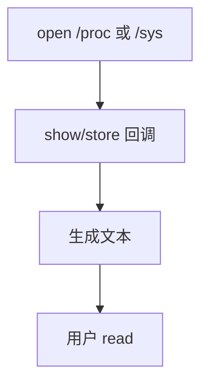

# proc 与 sysfs

proc 把进程与若干内核表格导出成文件；sysfs 按设备模型把 kobject 树导出成属性文件。

<footer>—— 据 Linux proc(5)/sysfs 文档；Love 对 kobject 的整理</footer>

[上一课](/cs/kernel-module)注册了设备，用户还没有可移植的「查看与微调」接口。[VFS](/cs/vfs) 允许没有块设备的伪文件系统。[挂载](/cs/mount-super) 已提 proc。缺口是把 **proc 与 sysfs** 收成两棵树：一个偏进程与杂项，一个偏设备模型。读它们走普通 `read`，实现是回调填缓冲。

## 问题

若只有 `ioctl` 魔数，工具无法用 cat/grep。proc：`/proc/self/maps`、`stat`、sysctl 风格的 `/proc/sys`。历史堆积使 proc 变杂。sysfs：一设备一目录，属性一文件，与 kobject 生命周期绑在一起，热插拔时目录出现消失。缺口不是新的 inode 磁盘格式，而是 `show`/`store` 回调与权限。

本课不把每个 `/proc` 文件列成清单。

sysfs 属性通常短、一值一文。大块二进制不该放 sysfs。debugfs 是第三棵调试树，主干点名即可。

## 方法

内核挂载 `proc`、`sysfs`。lookup 生成 inode；`read` 调 show，把当前 jiffies、模块列表、队列深度等格式化进页。[页缓存](/cs/page-cache) 对它们往往是临时的。写 sysfs 可能改参数，须权限检查。模块在 init 里创建属性，exit 里删除，避免悬空。

## 机制

伪文件系统让「内核状态」复用文件抽象，shell 与监控工具不必新系统调用。它们不是真实持久：崩溃一致性课的日志与此无关。过度读 `/proc` 可能有开销（每次生成）。不要把 sysfs 写成攻击面扫描教程。

与 dcache 的关系：这些 dentry 常是动态的，lookup 时创建。

## 边界

本课不引入 netlink 的全部通用套接字。不保证 ABI 文本格式永不改变。下一课问：这些文件系统出现之前，机器如何从复位走到能 `mount` 的内核。

后课默认：运行中的内核可经文件查询。从引导加载器到 `start_kernel`，下一课早期启动。

## 小结

- proc 偏进程与 sysctl；sysfs 偏 kobject 设备树。
- 读写是回调，不是磁盘块。
- 复位之后如何进入内核，是 early-boot 的缺口。
- 出处：Linux `proc(5)`、sysfs 文档；Love, *LKD*。
