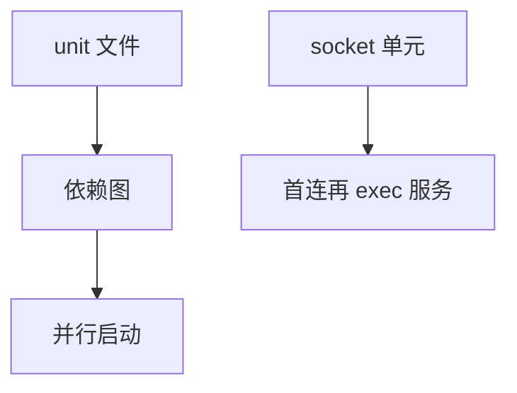

# systemd 单元与依赖

systemd 用单元描述服务、挂载、socket：依赖图决定启动顺序，socket 激活让守护在第一连接才起。

<footer>—— 据 systemd 文档对 unit 的说明；Poettering 对依赖与并行启动的论述</footer>

[initramfs](/cs/initramfs-pivot) 把 PID 1 交给真根上的 init。缺口是 **systemd 单元模型**：不是 SysV 脚本百科，也不把桌面 session 写完。

## 问题

`After=`/`Requires=`/`Wants=` 语义不同：硬依赖失败则自己失败。socket 单元：先听端口。缺口：cgroup 与单元默认绑 [memcg](/cs/memcg)/cpu；与 [capabilities](/cs/linux-capabilities) 的 `AmbientCapabilities`。本课不把每个指令写成手册。

事务：一次启动计算最小图。循环依赖会打破或警告。对象是 PID 1 策略，不是内核调度器。

## 方法

解析 unit → 建图 → 并行启动无依赖者 → 监督重启。对照 [timer wheel](/cs/timer-wheel)：`timer` 单元用日历或单调时间。对照 [qdisc](/cs/tx-path-qdisc)：无关。对照 LSM：`PrivateTmp` 等用命名空间落地。

## 机制

单元把「开机要做的事」收成可依赖的对象，使并行与重启策略可声明。它不替代内核。不要写成 init 战争。与 [audit](/cs/kernel-audit)：服务可带自己的日志，journal 是用户态。

错误的 `Type=forking` 会让依赖提前满足。

实现上：Requires 失败会把依赖者拉倒，Wants 不会。Type=notify 等 sd_notify 才算启动完成。socket 激活让崩溃的守护在下一连接再起。 读法上只引用[上一课](/cs/initramfs-pivot)的结论，不把对象换成训练推理或限价簿。

本课在操作系统进阶的「安全、启动与调试 / 内核安全与启动」课序里，对象是 **systemd 单元与依赖**。

- 先修只引用，不重导：上一课的结论当公理，本课只补差。
- 五栏不吞并：不把本课写成大模型训练/推理，也不写成限价簿或权重量化。
- 文献用 OSTEP、McKusick、内核文档与具名会议论文；不发明 arXiv 编号。

## 边界

本课不引入用户 manager 的全部。不保证嵌入式 busybox init。下一课内核如何被 PID 1 之前参数化：命令行。

版本字段会变，课序钉的是机制对象「systemd 单元与依赖」，不是某一主线内核的结构体名。
后课默认：用户态服务是带依赖的单元。内核 cmdline，下一课。

## 小结

- systemd 单元构成依赖图并可 socket 激活。
- 与 cgroup/命名空间接口相连。
- 内核命令行是下一课。
- 出处：systemd.unit(5)；systemd 文档。
