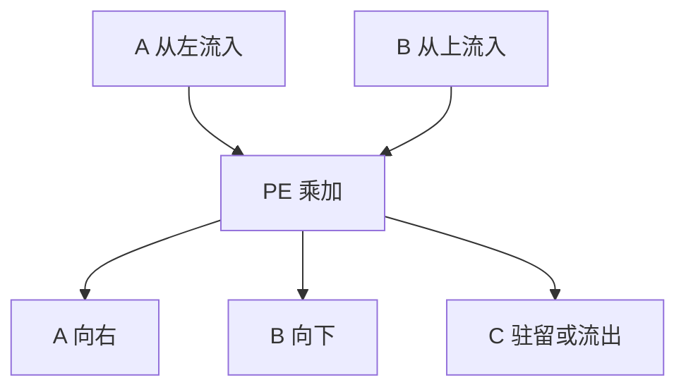

# 脉动阵列

数据沿阵列的边拍拍推进，每个单元做一次乘加再把数递给邻居；控制极简，带宽花在边界上而不是每拍从寄存器堆广播。

<footer>—— 据 Kung and Leiserson；Kung, Why Systolic Architectures?, IEEE Computer 1982 整理</footer>

[上一课](/cs/memory-coalescing) 仍每拍从存储子系统拉 warp 的横截面。矩阵乘一类核：同一行被许多列复用。本课不重讲 coalescing 分桶。缺口是 **脉动阵列：把复用变成空间上的邻接传递**，单元间寄存器即可，不必每次回 [HBM](/cs/gpu-memory-hierarchy)。

## 问题

$C+=A\times B$ 的每个 $A$ 元素被用 $K$ 次。SIMD/SIMT 仍要反复读寄存器或 shared。缺口不是更大的 warp，而是**网格上的 PE：左邻的数向右流、上邻的数向下流，本地 MAC 常驻。** 控制流几乎没有，[发散](/cs/warp-divergence) 不存在。

Kung 的 systolic：数据像血液被泵过阵列。当代矩阵单元（各种 MMA）是这一思想的密集实现；本课讲结构，不写某公司指令名当产品手册。

## 方法

PE $(i,j)$ 每拍：收下 $a$、$b$，做 $c\leftarrow c+a\cdot b$，把 $a$、$b$ 传给指定邻居。阵列边界从存储器或缓冲注入流。填充与排空要若干拍，对应向量机的流水启动。

## 机制

运算强度：边界带宽 $O(n)$、计算 $O(n^2)$（方阵示意），正是后课 Roofline 的高算术强度端。与 [向量 lane](/cs/vector-lanes)：lane 共享指令、数据仍从 VRF 广播或 gather；脉动把数据路径硬化成邻居边。DSA 下一课把这种阵列（或相近的固定数据路径）封进领域加速器。

## 边界

本课不把注意力矩阵乘的软件映射写进来。不规则图计算难以脉动。近存下一课解决的是「搬数据」另一极端：算子搬到 DRAM 边上，而不是在 PE 网格里流。

后课默认：规则稠密线性代数适合空间流水。把整条固定流水封成加速器，是 DSA。

## 小结

- 脉动阵列用邻接传递复用数据，控制极简。
- 启动排空是空间流水的气泡。
- 领域加速器把这种数据路径固化，下一课。
- 出处：Kung and Leiserson；Kung, *IEEE Computer*, 1982。
