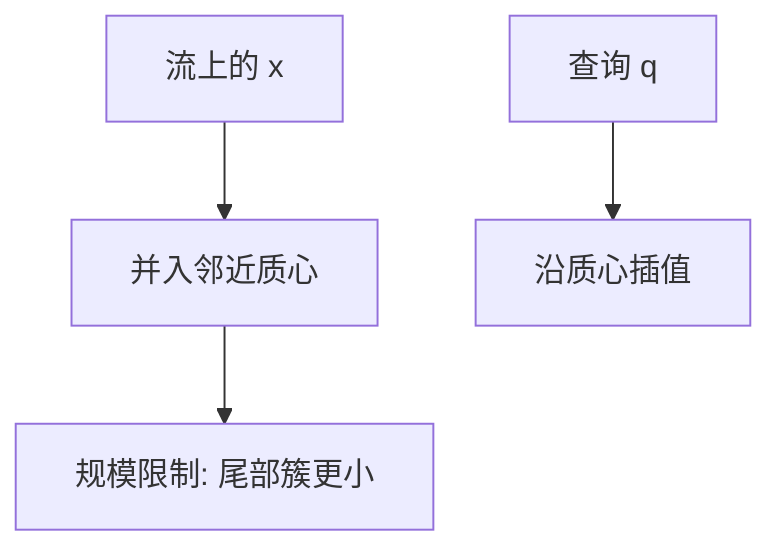

# t-digest 与分位数

用一组质心近似经验分布，两端的簇更小，使尾部分位数更准；合并质心可分布式求近似百分位。

<footer>—— 据 Dunning and Ertl, Computing Extremely Accurate Quantiles Using t-Digests, 2019；Greenwald and Khanna, Space-Efficient Online Computation of Quantile Summaries, SIGMOD 2001 整理</footer>

[上一课](/cs/reservoir-sampling) 均匀留 $k$ 个点，估分位数方差随 $k$，尾部差。[Count-Min](/cs/count-min-sketch) 不保序。精确百分位要排序或选择算法 $\Theta(n)$。[顺序统计树](/cs/order-statistic-tree) 要存全体。本课不替换蓄水池元素。缺口是流上分位数摘要：t-digest（及 GK 作为对照）。

## 问题

查询近似 $q$-分位数，$\varepsilon$ 相对或绝对误差。GK 摘要：$\Theta((1/\varepsilon)\log(\varepsilon n))$ 样本点。t-digest：质心 $(m_i,c_i)$（均值与计数），规模限制函数让 $q$ 近 $0$ 或 $1$ 时簇更细。插入：并入邻近质心或新建，过限则压缩。缺口是**用可变宽度直方图换尾部精度**，且 `merge` 自然。

Dunning and Ertl 描述 t-digest（技术报告 / 期刊化版本 2019 左右）。Greenwald–Khanna *SIGMOD* 2001 是经典确定摘要。本课不发明 arXiv 编号。

## 方法

实现：按均值有序的质心缓冲，压缩时按权重限制合并邻居。查询：在质心序列上插值。合并：拼接再压缩，适合多机。不要用 HLL 估分位数。

与蓄水池：池给出可复查的原始样本；digest 更省、专攻分位。与 CM：CM 键频次，digest 是值域分布。

## 机制

误差启发式依赖压缩与限制函数，实践中位数准、极端百分位仍要更多空间。合同写近似，监控延迟分位足够，金融结算精度不够则存精确结构。

概率课序结束。下一单元持久化：路径复制从线段树升到一般方法，接 Okasaki。

## 边界

本课不把 DDSketch、HDR Histogram 写成百科列表，只承认同问题。不进入 LOB 价格分位实证。并发无锁摘要后课另说。

后课默认：流分位数可用 t-digest/GK。不可变结构的共享从路径复制讲起。

## 小结

- t-digest：质心近似分布，尾部更细，可合并。
- GK 提供更经典的确定误差摘要。
- 下一单元：持久化与无锁结构。
- 出处：Dunning and Ertl；Greenwald and Khanna, *SIGMOD*, 2001。
