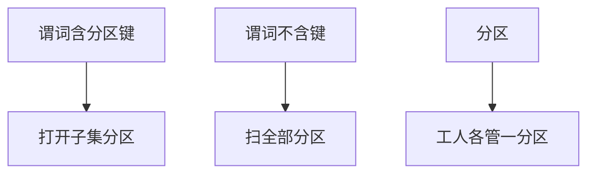

# 表分区

分区是声明的水平切：扫描只打开命中分区，维护与并行以分区为粒度；切错键则变成全部分区都扫。

<footer>—— 据 Ramakrishnan and Gehrke；Leverenz et al. Oracle 分区；PostgreSQL 声明式分区</footer>

[上一课](/cs/blob-storage)把大值撤出行扫描。本课不流式读段。缺口是表太大：统计、VACUUM、索引、查询仍当一个堆。表分区（partitioning）按键范围、列表或哈希把行分到子表，优化器做分区裁剪（partition pruning），执行器并行按分区。

## 问题

主干 [分片直觉](/cs/sharding) 偏分布式。本课单库内分区：同一模式、同一事务，只是物理多堆。缺口是**裁剪合法性**：谓词必须约束分区键且 sargable，否则扫描所有子表，比未分区还多个计划节点税。

维护：删旧范围分区等于丢掉冷数据，比 `DELETE`+vacuum 快。索引：局部索引每分区一份，全局索引跨分区（实现更重）。唯一约束若不含分区键，全局唯一贵。

声明式分区把路由写进计划。触发器路由是旧路径。本课声明。与分布式 shard 的差别是提交与故障域仍是一库。

## 方法

选键：时间、租户、哈希 id。查询必须带键。连接：两表同键同切可分区智能连接（对应分区两两连），否则先 exchange。默认分区接住未列值，防止静默丢失。

迁移：从一堆拆成分区是模式演化课的重 I/O 脚本。附加：detach 分区变成普通表，服务归档。

## 机制

zone map 在分区级就是约束本身。统计：每分区直方图，全局 NDV 要合并草图。计划回归：数据跨过分区边界，昨日裁一区、今日裁两区，属预期；无谓词突然不裁才是回归。

复制：物理复制所有分区文件；逻辑复制可按分区过滤。

## 边界

本课不讲 TDE。也不把分区当 5NF。分片再平衡是分布式课，单库分区 rebalance 是数据搬家脚本。

后课默认：大表按查询谓词选分区键；无键谓词等于未分区。透明加密与压缩：页在落盘前的变换，与切表正交。

分区裁剪是下推的亲戚，防火墙同样是函数包住分区键。

## 小结

- 分区水平切堆，裁剪依赖分区键谓词。
- 局部索引与约束设计随键走；并行按分区。
- 透明加密与压缩下一课：落盘变换。
- 出处：Ramakrishnan and Gehrke；声明式分区实践。
