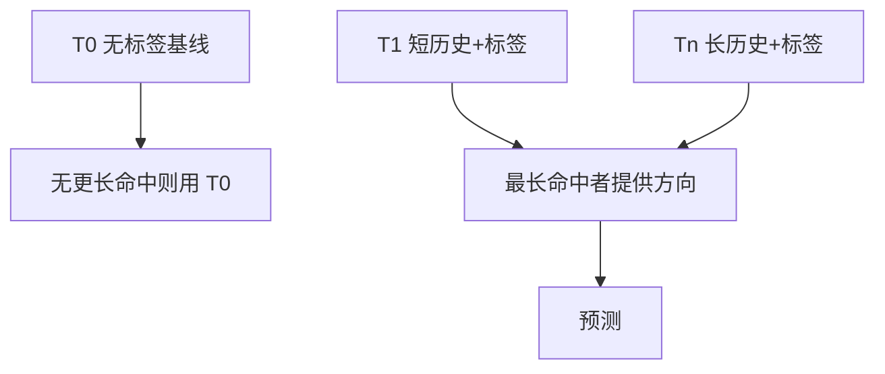

# TAGE

用一组几何增长的历史长度，每张表带部分标签：最长且命中的那张说话，短历史只在长的缺席时顶上。

<footer>—— 据 Seznec and Michaud, A case for (partially) tagged geometric history length predictors, JILP 2006 整理</footer>

[上一课](/cs/gshare-predictor)用一条 GHR 异或 PC 索引一张 PHT。固定长度：短了看不见远相关，长了新分支训不熟、别名把旧相关挤掉。本课不重做异或散列。缺口是：**同一时刻让短历史与长历史共存，用标签决定哪一张表真的「认出」了这条分支。** 这就是 TAGE（TAgged GEometric）。

## 问题

有的分支只依赖最近 1–2 次方向，有的依赖几十次以前的一次比较（循环嵌套、解释器分发）。gshare 只能选一个 $h$。把 $h$ 拉长，PHT 里大量槽永远训不热。把多张不同 $h$ 的表简单并排，又会在同一 PC 上互相打架。缺口不是再加锦标赛的一路局部，而是**按几何序列准备若干张带标签的表，命中最长者优先**。

几何：例如 0、2、4、8、16、32、64。基础表（T0）通常无标签，相当于 bimodal，保证总有一个预测。

## 方法

T0：按 PC 索引的两位计数器，无标签。$T_i$（$i\ge 1$）：用 `hash(PC, GHR[h_i])` 索引，条目含部分标签、有符号计数器、有用位。预测：从最长 $i$ 往下找第一条标签匹配；若全未命中，用 T0。更新：只更新提供者（以及偶尔分配更高表项）；有用位在正确预测时置位，周期性衰减，以保护仍有价值的长历史项。

分配发生在误预测且更高表有可替换项时：新项写入当时的长历史散列与标签。这与 cache 填入相似，只是「命中」是标签相等。

## 机制

TAGE 把 gshare 的「一张表、一种 $h$」拆成可共存的多种 $h$。别名被部分标签挡住：错误的历史不会悄悄改到别人的计数器。有用位是替换策略，不是 ISA。对乱序核，核对仍在提交端；推测更新可用检查点回滚 GHR 与新分配，原则与上一课相同，结构更重。

实用变体（TAGE-SC-L 等）再加统计校正与循环预测器，那是后课循环预测要接的插件，本课只钉几何表与提供规则。

## 边界

本课不把感知器的点积引入 TAGE 表内。间接跳转的 ITTAGE 是同一思想换「目标」而不是方向，下一课之后才碰。也不比较商业 CPU 的具体表项数。

后课默认：需要超长相关就想到带标签的几何历史；gshare 仍是最短实现。线性可分的分支用权重，是下一课感知器。

## 小结

- TAGE：几何长度 + 部分标签，最长命中者预测。
- 基线无标签表保证冷分支仍有答案。
- 感知器走另一条：把历史当特征而不是索引。
- 出处：Seznec and Michaud, *JILP*, 2006；Seznec 后续 TAGE 变体。
