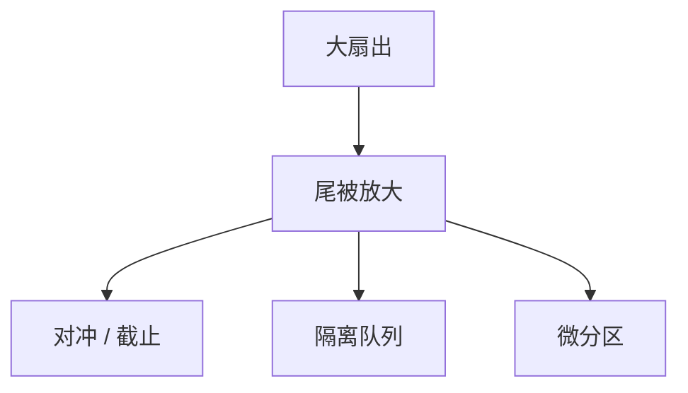

# Tail at Scale

规模把罕见变常见：千分之一的慢，在扇出足够大时变成每次用户请求的常态。要在每一层减尾，而不是只加速平均数。

<footer>—— 据 Dean and Barroso, The Tail at Scale, CACM 2013 整理</footer>

[上一课](/cs/borg-kubernetes)把集群调度钉成 Borg / Kubernetes。[对冲请求](/cs/tail-latency-hedging)已用第二份换 P99。缺口是**把同一篇文章读成系统设计清单**：微分区、请求截止、大类隔离、队列管理，以及为何共享集群让尾更肥。本课不重写对冲算法细节。后课分布式 ID 是另一条「规模下的生成器」问题。

## 问题

用户请求 = 许多微服务 × 许多分片。尾延迟分布有长尾，最大值的期望随扇出变坏。来源：后台作业、垃圾回收、磁盘寻道、包重传、邻居干扰、慢盘。平均数优化（更好的中位数机器）不自动砍尾。

Dean–Barroso 清单：对冲/备用请求、把大作业切小（微分区）、按类隔离队列、快速失败、同步打破（不齐步）、复制选择性。缺口：只在网关对冲，底层队列仍堆着不取消的工作。

与通信课的对冲课分工：那课钉 RPC 第二份；本课钉规模为何让尾变成一等指标，以及多层对策。

## 方法

SLO 用尾不用均。取消要贯穿。批处理与交互分池，接 Borg 的优先级。避免全局锁与单热分片（热键课）。测量用追踪看哪一跳贡献 P99，接三支柱。

不要用「再买更快的 CPU」当唯一手段：共享与排队会把快机器变慢尾。

## 机制

同步：所有分片等最慢者（barrier）把尾变成和。能流式返回则流式。重试无抖动在规模下变成同步惊群。熔断保护平均数，也可能把尾变成立即错误——错误预算要算进去。

本课不把 CACM 文当成金融交易所低延迟设计。也不写光刻。

多租户：Borg 的 best-effort 任务会偷周期，guarantee 档减尾但降利用率。这是 PACELC 在延迟–成本上的投影，不是 CAP 分区。

## 边界

本课不给具体 P99 毫秒数当规范。后课默认：规模服务的规格写尾延迟与扇出；对策多层。分布式 ID 下一课避免中心计数器成为尾与热点。地理复制把延迟下限变成光速。

砍尾是架构税。只优化均值的报表会在扇出后说谎。

## 小结

- 扇出把稀有慢变成用户常态。
- 对冲、隔离、微分区、可取消、打破屏障。
- 共享集群利用率与尾延迟交换。
- 出处：Dean and Barroso, CACM 2013。
