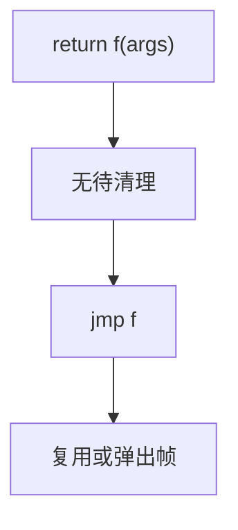

# 尾调用优化

若 `call` 的结果就是当前函数的返回值，且当前帧不再被需要，则可释放帧并把调用改成跳转。空间从线性变成常量。

<footer>—— 据 Steele, Debunking the 'Expensive Procedure Call' Myth；Scheme 报告对 proper tail calls；Appel, Compiling with Continuations 整理</footer>

上一课[内联](/cs/inlining-heuristics)用复制换开销。缺口是**不复制**的调用优化：尾调用（TCO）。Scheme 要求 proper tail calls；C 不保证。本课钉何时合法，与[蹦床](/cs/trampolining) 后课对照只点名。不写 CPS 变换全文。

## 问题

`return f(x)` 在调用后当前函数无工作。栈上若仍留帧，递归 `f` 会爆栈。优化：调整参数、`jmp f`。缺口是**帧与调试/异常**是否还需要当前帧（析构、清理）。

C++：析构函数使许多「看起来像尾」的调用不是尾。必须先跑清理则不能 TCO，或变成先清理再跳（仍可能）。

### 尾递归不是全部尾调用

尾递归是 callee 为自身；TCO 对任意尾位置调用。互递归同样可跳转。不要只教「编译器把递归变循环」这一特例。

Steele 1977。R*RS proper tail calls。Appel 指出 CPS 后所有调用是尾。本课 IR 级：`ret (call ...)` 形态。

## 方法

识别：调用结果立即返回，无待办副作用。ABI：callee 与 caller 约定兼容（参数寄存器），否则要垫片。不同函数尾调用可能要调整栈参数区。

与内联：小的尾递归可内联成循环；大的只 TCO。不要二者都做导致体爆炸再 TCO 无意义。

## 机制

诊断：语言若保证 TCO，漏优化是 bug；C 则是质量。调试器：帧消失，backtrace 变短——DWARF 可选用虚拟帧。不要在必须精确栈展开的异常路径上静默 TCO 而不更新 unwind。

## 边界

本课不写完整 CPS。后课默认：尾位置调用可变成跳转。下一课逃逸分析：堆分配能否改栈，与帧寿命相关。

也不把 TCO 当异步协程的定义。

## 小结

- 尾调用：复用帧，call 变 jmp。
- 清理、ABI、异常表限制合法性。
- 尾递归是特例；互递归同样适用。
- 出处：Steele；Scheme 报告；Appel。
