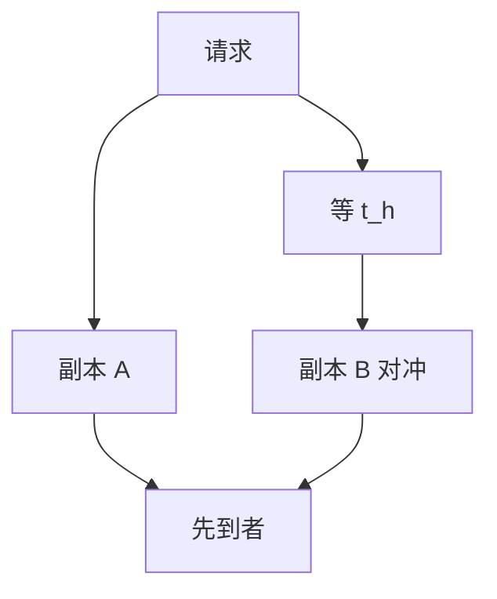

# 尾延迟与对冲请求

一次用户请求扇出到许多后端，任一慢尾都会变成用户的 P99。对冲是再发一份，用多余负载换尾延迟，必须受预算约束。

<footer>—— 据 Dean and Barroso, The Tail at Scale, CACM 2013 整理</footer>

上一课[超时退避](/cs/timeout-backoff)把重试放在失败之后。缺口是**还没失败、只是慢**：等超时才重试，用户已经付了长尾。Dean–Barroso 提出对冲：短等之后向另一副本再发。本课钉机制与放大风险。后课负载均衡决定第二份打到谁。完整「规模下的尾」在存储运维课序的 Tail at Scale 课还会从机房层再收一次，本课只接通信路径。

## 问题

扇出 $k$ 路，独立尾延迟分布的最大值变差。队列、GC、磁盘、包丢都会造长尾。对冲：主请求发出后 $t_h$ 仍无应答，复制一份到另一副本，谁先回用谁，取消另一份（若协议支持）。缺口：对冲在系统已过载时变成雪崩——人人发两份。

与幂等：对冲写等于并发双执行，必须[幂等键](/cs/idempotency-keys)或只对读对冲。

CACM 2013 把对冲、备用、微分区、tail-tolerant 设计写在同一文。后课 `tail-at-scale` 从运维与机房再讲，本课不抢那层。

## 方法

只对幂等读默认对冲。$t_h$ 取历史延迟分位数（如 P95），不要 0（即双发打满）。对冲计入重试预算。取消要真能停下游工作，否则负载仍在。

与熔断：下游已开熔断不要对冲打另一实例同一过载池。

## 机制

负载放大：仅当慢尾触发，平均放大远小于 2。过载时人人变慢，$t_h$ 总触发，放大趋近 2，正反馈。所以对冲要有全局预算与「仅健康实例」。这与[限流](/cs/rate-limit-circuit-breaker)同一负反馈家族。

本课不把对冲写成金融对冲。也不写 WAN 任播的全部细节。

备份请求（hedged）与复制请求（同时双发）差别在 $t_h$。同时双发延迟更好、平时负载 ×2，只适合极热路径。

## 边界

本课不写 Google 内部的具体 $t_h$ 数字当规范。后课默认：读路径才考虑对冲；写路径先幂等。负载均衡下一课决定副本选择，对冲是第二次选择。Tail at Scale 课把跨层排队再展开。

慢不等于死。把慢当死而无预算，检测器误伤会变成过载。

## 小结

- 扇出放大尾延迟；对冲用第二份换 P99。
- 必须延迟触发、计入预算、优先只读。
- 过载时对冲变双发，要能自动关掉。
- 出处：Dean and Barroso, CACM 2013。
