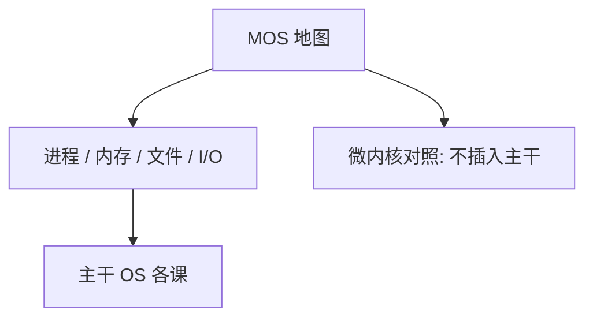

# Tanenbaum 现代操作系统

操作系统是资源与抽象的教材对象：进程、内存、文件、I/O；微内核与单体是实现对照，不是本栏另开的一课。

<footer>—— Tanenbaum and Bos, Modern Operating Systems</footer>

[上一课](/cs/dragon-book)附录对照了编译龙书。附录对照，不插入主干。本栏附录到此结束。主干已在[内核与用户态](/cs/dragon-book)到[VFS](/cs/vfs)、[I/O 与 DMA](/cs/io-dma)里按映像、调度、同步、虚存、文件走过 OS；这里对照 **MOS 教材的问题**：如何把这些子系统收成可教的一本，并用 MINIX 一类系统当存在性证明。不重做 CFS 与 inode。

## 问题

Dijkstra 给出互斥规格；主干把它放进锁课。Tanenbaum 的缺口是整机教材：从中断到文件系统的工程地图，以及微内核辩论（消息换内核入口）。主干按树上课，不把 MINIX 源码当必读，也不把 Windows/Linux 型号审计插进主干——型号与实现审计是附录级，本篇只对照教材地图。

Bovet/Cesati、CSAPP、OSTEP 是另几本对照。主干用「内核是引用监视器 + 资源调度器」这一层，不绑死某一本书的章节号。

## 方法

教材分：进程与线程、调度、同步、死锁、虚存、文件、I/O、多处理。主干顺序与此相近，但把组成与体系结构的页表、TLB 放在 OS 之前讲硬件。MOS 常从 OS 视角再讲一遍分页；本栏不重复，OS 课只补[按需调页](/cs/demand-paging)与替换。

## 机制

把 OS 写成抽象：进程是映像与调度单位，文件是字节流，VFS 是对象接口。主干已经这样命名。微内核把驱动放到用户态，用消息替代许多系统调用路径——主干[系统调用路径](/cs/syscall-path)不改成消息课，附录只标明这是实现轴。安全课的隔离与沙箱假定这张地图已经存在。

### 为何对照而不插入主干

若把 MOS 插在编译与 OS 之间当「必读全书」，课序会变成教材目录。本栏 OS 第一课接运行时 GC，对象是内核边界。附录对照教材，结束文献序列：不再插入第五种子系统。

## 边界

不要把 MINIX 版权争论写成课文。也不要在附录里开容器编排。计算机栏主干已在[计算栈到此为止](/cs/to-systems-boundary)封口；本附录是文献对照的最后一篇，不把读者送回比特课，只送回那张系统地图。

分布式 OS 与移动计算是 MOS 后段章节，本栏主干不收；需要的话属于另一棵树，不插在安全课之后当续篇。

对照结束应回到主干 OS 课与[计算栈到此为止](/cs/to-systems-boundary)。文献序列在此终止，不把 MOS 后段章节续进主干。

## 小结
- 附录对照，不插入主干。
- 文献对照在此结束；主干封口仍是计算栈到此为止。

- 附录对照 Tanenbaum MOS：OS 子系统教材地图与微内核对照。
- 主干 OS 课已按映像到 VFS 取用；型号与源码审计不进主干。
- 文献对照序列在此结束；主干封口仍是 to-systems-boundary。
- 出处：Tanenbaum and Bos, *Modern Operating Systems*。
