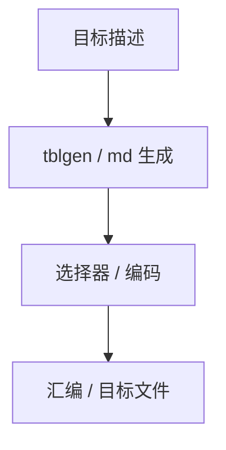

# 目标描述与 TableGen

把寄存器类、指令编码、选择模板写成声明式描述，生成选择器与汇编器，而不是为每个 opcode 手写一份 C。

<footer>—— 据 LLVM TableGen 文档；GCC MD 机描述传统；Appel 对机器描述的讨论整理</footer>

上一课[树匹配](/cs/tree-pattern-isel)要大量模板。缺口是**可维护的目标描述**：LLVM TableGen（`.td`）、GCC `md`。本课钉描述驱动后端，不把 TableGen 语言当手册抄完。调用约定下一课再实现细节。

## 问题

手写 ISel 随 ISA 组合爆炸。描述：指令格式、约束、模式 `add r, r, r`。生成：匹配器、编码、反汇编。缺口是**生成器链**，不是 DP 方程。

寄存器类：GPR、FPR、约束子集（`x86` 的 `eax`）。描述错误则选择成功但编码错。

### `.td` 不是源语言类型系统

它是编译器的 DSL。与[DSL 嵌入](/cs/dsl-embedding) 后课对照：这里是编译器实现 DSL，不是用户程序 DSL。

LLVM TableGen。GCC 的 Define_Insn。本课不引用虚构论文号。工程文献以文档与源码为准。

## 方法

写寄存器、指令、模式。跑 tblgen。检查：单测 MIR。增量：新指令加一条记录，不改匹配引擎。

与调度：描述可含延迟与资源（itinerary），供表调度。缺模型则调度盲。

## 机制

生成代码巨大，编译编译器变慢。版本：描述与 LLVM 版本绑定。不要在 `.td` 里写任意副作用 C++ 还指望可证明。

交叉编译：同一描述可被不同主机的 tblgen 跑——后课三元组。

## 边界

本课不写调用约定 lowering 全文。后课默认：ISA 用描述生成后端。下一课调用约定实现：参数、返回、调用者保存如何从描述落到 lowering。

也不把 TableGen 当数据库 schema 课。

## 小结

- 目标描述生成选择、编码、调度表。
- TableGen/GCC MD 是声明式，减手写组合。
- 寄存器类与约束是一等公民。
- 出处：LLVM TableGen；GCC MD；对照 Aho 树匹配、Appel。
