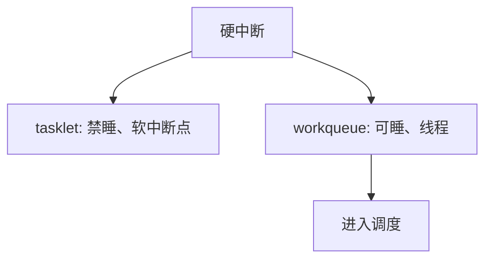

# tasklet 与 workqueue

同一条下半部纪律下，还要再分：仍禁睡眠的串行小函数，以及跑在内核线程里、可以阻塞的工作项。

<footer>—— 据 Love, Linux Kernel Development；Bovet and Cesati 整理</footer>

[上一课](/cs/hardirq-softirq)给出硬/软两档上下文，软中断仍不能睡。网卡协议之后若还要分配可睡的内存、要等文件系统，软中断会拖死返回路径。缺口是两种排队对象：**tasklet**（或同类：软中断里串行执行、禁睡眠）与 **workqueue**（内核工作线程上跑、可睡眠）。本课只钉这一分档，不写框架的全部 API。

## 问题

软中断类型少、全局 pending 位粗。驱动需要「就这块缓冲、稍后再算」而不占用一种软中断号。tasklet 把函数指针挂进每 CPU 队列，在软中断点串行跑完——仍禁睡眠，但比新注册一种软中断轻。真正要 `mutex_lock`、要拷用户页，必须换到进程上下文：workqueue 把工作项交给 `kworker` 一类线程，调度器可见。缺口是这套分流，不是新的设备 IRQ 硬件。

同一 tasklet 在单 CPU 上不重入；能否在多 CPU 上并行，实现有「一次一个」的变体。workqueue 可以并发，提交者必须自己保护共享数据。

## 方法

ISR 或软中断：`tasklet_schedule` 把后续函数入队；或 `queue_work` 把项交给工作队列。tasklet 在软中断里执行；work 在线程里执行，可调用[系统调用路径](/cs/syscall-path)同款的可睡函数（自己就是内核线程）。禁止在硬 IRQ 里直接睡，这条不变。

选择标准：要不要睡、要不要与特定进程的地址空间绑在一起。绑定用户缓冲的工作往往要在发起 `read` 的那个进程上下文做，那是线程化中断的后话。

## 机制

分流让[调度指标](/cs/scheduling-metrics)里的延迟可解释：tasklet 仍增加软中断尾延迟；work 的延迟是调度延迟，可能被公平调度器摊薄。上半部与这两类队列之间的描述符仍是共享数据，后课的锁要标明「持锁者能否睡」。

不要把 workqueue 当成用户进程：它没有用户 trapframe，但有内核栈与调度实体。

## 边界

本课不把 Linux 工作队列的 `WQ_HIGHPRI`、绑核属性写成运维手册。也不把 tasklet 的弃用时间线当主干：对象是「禁睡回调 vs 可睡线程」，名字可以换。threaded IRQ 是下一课。

后课默认：可睡工作进线程。若希望整条 IRQ 处理都是可调度、可设优先级的线程，下一课讲中断线程化。

## 小结

- tasklet：软中断点上的禁睡回调；workqueue：可睡的内核线程工作项。
- 硬 IRQ 里仍然不能睡眠。
- 把 IRQ 整条做成线程是下一课。
- 出处：Love, *LKD*；Bovet and Cesati。
