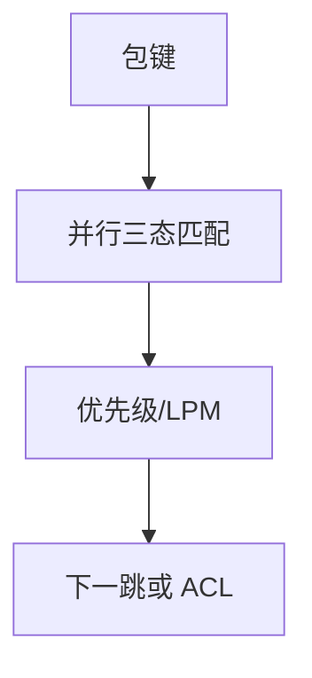

# TCAM 查表

三态内容寻址把前缀与掩码一次并行匹配，再按优先级编码出最长前缀；容量贵，所以 FIB 与 ACL 都在抢这块硅。

<footer>—— 据 McAuley and Francis, Fast Routing Table Lookup, INFOCOM 1993；交换芯片查表实践整理</footer>

[上一课](/cs/router-architecture) 假定 LPM 线速。主干[最长前缀匹配](/cs/lpm) 给算法直觉。缺口是**硬件怎么一次比完**：TCAM 的 0/1/X、优先级编码器、与 SRAM 流水对照。本课不把 OpenFlow 流表写完。

## 问题

软件树/哈希在最坏深度上抖动。TCAM：每个比特存值与掩码，包键并行比较，命中集用优先级取最长或最先。ACL 五元组同样是三态。代价：功耗、容量（数十万量级则贵）、更新要插空洞避免打断线速。算法类 LPM（树、 trie）用 SRAM 换更新友好，最坏延迟要工程保证。

不要把 TCAM 写成「无限智能」：表满则无法再装更细前缀，运营要聚合。

TCAM 也用于 MAC、流表。本课不讲电路晶体管。更新与查表并发是芯片内部课题。

### 并行匹配有容量税

三态一次比完，再取 LPM/优先级。表满无法再装细前缀。IPv6 更宽的键更吃硅。

## 方法

对照：TCAM 并行 vs trie 多级。画：键 → 匹配向量 → 优先级 → 动作（下一跳、ACL drop）。RPKI 无效丢弃是动作之一，仍占表项。

方法止于选定对象与对照；机制才说它如何嵌入已有分层与主干课。

## 机制

EVPN MAC 规模可压垮表，要聚合或层次。ECMP 下一跳组在 SRAM，TCAM 只指向组号。OpenFlow 后课把多级流表暴露给控制面，硬件仍常是 TCAM 级联。与容量 $C$ 无关：查表是转发税，不是信道。

安全：故意装大量更长前缀可耗尽 TCAM，像 MAC 耗尽。

## 边界

本课不引入算法 LPM 的全部压缩 trie。SDN 与 OpenFlow 是下一课。后课默认：线速 LPM/ACL 靠 TCAM 或等价并行匹配，容量是硬约束。

IPv6 更宽的键更吃 TCAM，这是过渡课留下的硬件账。

上一课留下的缺口在本课收口；「TCAM 查表」进入后课词汇表后只引用。文献用来钉对象与边界，不把本课写成该主题的独立综述。下一课[SDN 与 OpenFlow](/cs/sdn-openflow)。

## 小结

- TCAM 并行匹配三态键，再取最优。
- 容量与功耗限制细前缀与 ACL。
- SRAM 算法查表换更新，要保证最坏时延。
- 后课只引用本课钉死的对象，不从该领域总问题重开。
- 出处：McAuley–Francis, 1993；芯片实践。
