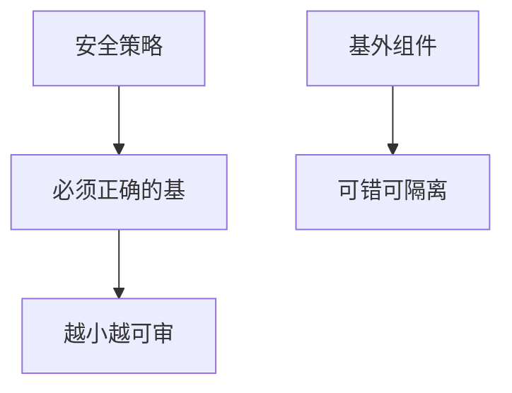

# TCB 最小化

可信计算基是其正确性被依赖来强制策略的全体。体积越大越不能审。微内核、TEE、语言运行时都在削 TCB；seL4 把削完的核送进形式证明。

<footer>—— 据 Lampson 对保护；Saltzer 经济机制；对照 Klein et al. seL4</footer>

## 定位

上一课[纵深](/cs/defense-in-depth)多层。缺口是**每层的核有多大**。本课 TCB：什么必须对、什么可错。

后课默认已经读完本课钉下的合同，只补差，不从该领域第一性原理重开。

## 问题

巨内核+全部驱动在 TCB。缺口是：下推不可信、验证剩余。HSM/TEE 是削的实例。

### 依赖

编译器与硬件也在 TCB，除非另证。

Lampson。SDL 下一课是过程；seL4 是形式化封口。

## 方法

列当前系统 TCB。对照微内核。下一课 SDL，再 seL4。

图中节点是本课的机制骨架；课程不把图展开成可运行的攻击步骤。

## 机制

纵深的每一预防层都有 TCB。削它才能审。SDL 管如何造，seL4 管如何证。

前提写进合同之后，游戏外的误用只当失败模式点名，不在本课写成操作程序。

## 边界

不把所有系统改写成微内核作业。SDL 下一课。

## 小结

- 纵深每层都有 TCB。
- 体积决定能否审与证。
- 隔离把组件移出基。
- 下一课 SDL。
- 出处：Lampson；Saltzer and Schroeder；Klein et al.（下下课）。
