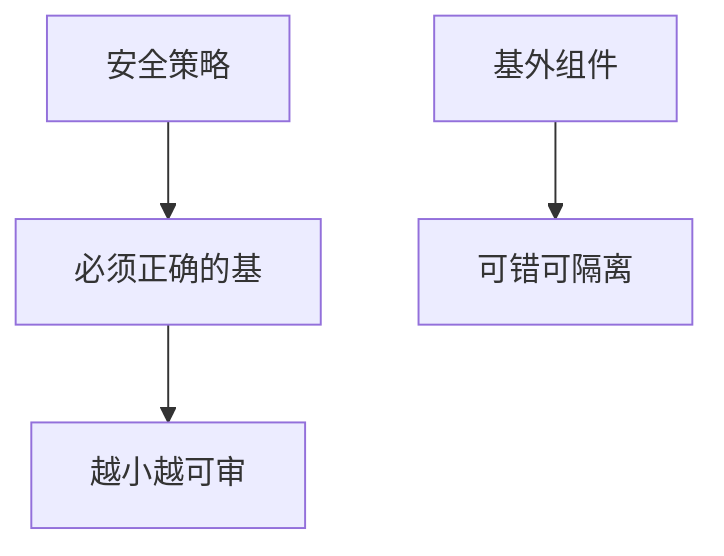

# TCB 最小化

可信计算基是其正确性被依赖来强制策略的全体。体积越大越不能审。微内核、TEE、语言运行时都在削 TCB；seL4 把削完的核送进形式证明。

<footer>—— 据 Lampson 对保护；Saltzer 经济机制；对照 Klein et al. seL4</footer>

上一课[纵深](/cs/defense-in-depth)给了多层防御；多层立刻引出新问题：**每一层自己有多大，多少代码必须正确**。本课 TCB 最小化回答的正是这件事——划清什么必须对、什么允许错。

后课默认已经读完本课钉下的合同，只补差，不从该领域第一性原理重开。

## 问题

单体内核加上全部驱动、解析器与文件系统都在 TCB 里：任何一行出错，安全策略即失守，而这套代码大到没有人能审完。缺口是两步操作：把尽量多的组件下推出信任基（用隔离和最小权限），再对剩下的核做验证或强审查。HSM 与 TEE 都是「削」的工程实例。

### 依赖

编译器与硬件也在 TCB：源码正确不等于编译产物正确，Thompson 的 trusting trust 攻击表明被植入后门的编译器能在目标码里复制后门而不留源码痕迹；除非另行证明（可复现构建、形式验证），它们都得计入。

Lampson。SDL 下一课是过程；seL4 是形式化封口。

## 方法

方法先是盘点：对给定系统列出「错了即策略失守」的组件清单，这一步常让人第一次看清 TCB 的真实体积。再对照微内核路线：把驱动、文件系统、网络栈移出内核态，只留 IPC、调度与基本内存管理。清单缩短之后，审查与证明才有落点。下一课 SDL，再 seL4。

```mermaid
flowchart TD
  POL["安全策略"] --> TCB["必须正确的基"]
  TCB --> SMALL["越小越可审"]
  REST["基外组件"] --> UNTRUST["可错可隔离"]
```

## 机制

纵深的每一预防层都有自己的 TCB：WAF 的规则引擎、MFA 的令牌校验、内核的访问控制，谁错了谁的层即穿。因此体积决定可审性：几百行的引用监视器可以逐行读完并证明，千万行的巨内核只能抽样测试。seL4 是这条路线的终点示范——先把微内核削到约万行 C，再用机器检查的证明封住「实现符合规范」。SDL 管如何造（过程），seL4 管如何证（产物）。

## 边界

不把所有系统都改写成微内核：削 TCB 有真实代价，单核的 IPC 开销与生态迁移成本摆在那里；对既有系统，先量出 TCB 再决定削哪里，比推倒重来常见得多。SDL 下一课。

## 小结

- 纵深每层都有 TCB。
- 体积决定能否审与证。
- 隔离把组件移出基。
- 下一课 SDL。
- 出处：Lampson；Saltzer and Schroeder；Klein et al.（下下课）。
