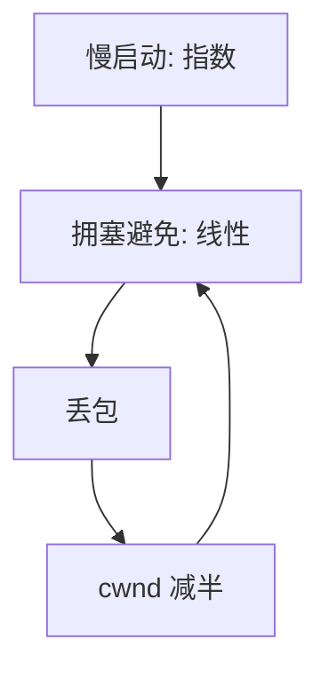

# 拥塞控制

网络自己的队列也会满；发送方必须根据丢包或延迟减小飞行数据，否则重传会加剧拥塞。

<footer>—— 据 Jacobson, Congestion Avoidance and Control, SIGCOMM 1988；RFC 5681 整理</footer>

[上一课](/cs/nagle-delayed-ack)用 rwnd 保护对端。路由器缓冲不是 rwnd 的一部分：多条连接共享瓶颈时，人人按 rwnd 发仍会丢。[UDP](/cs/udp) 不管这件事。缺口是 **TCP 拥塞控制**：慢启动、拥塞避免、AIMD，用 `cwnd`。本课不把每一种 CUBIC 曲线写成标准正文。

## 问题

1980 年代拥塞崩溃：丢包导致重传，重传增加负载。Jacobson：把丢包当信号，指数增大探测带宽（慢启动），线性探测（拥塞避免），丢则减半（乘法减小）。缺口不是再定义序号，而是飞行字节的第二条上限 `min(cwnd, rwnd)`。

本课以丢包信号为主；延迟信号（BBR 等）作边界对照。

AIMD：加性增、乘性减，多流共享瓶颈时有利于公平收敛（Chiu–Jain 直觉）。快重传可配快恢复，避免慢启动回退到 1。

## 方法

新连接：`cwnd` 从初始窗口指数增，直到丢或到 `ssthresh`。拥塞避免：每 RTT 大约加一 MSS。超时：`ssthresh` 记下飞行的一半，`cwnd` 回退。三个重复 ACK：快重传，进入快恢复。与[公平调度](/cs/timeslice-cfs)类比：都是份额，但这里没有中央 CFS，信号是隐式的丢包。

## 机制

拥塞控制是[端到端论证](/cs/layering-e2e)的实例：瓶颈队列在中间，端根据反馈调速，而不要求每台路由器为每流保留完整状态（与 ATM 式预留对照）。路由器可加 AQM/ECN 把信号显式化，本课不把 RED 参数调完。UDP 实时流若不节制，会挤占遵守 AIMD 的 TCP——政策问题点名。

与磁盘电梯不同：这里没有全局请求队列排序，只有分布式加减。

## 边界

本课不把 RFC 9438 CUBIC 的窗口公式当必推导。不引入数据中心 DCTCP 的全部标记逻辑。多路径 TCP 不进主干。下一课 QUIC 把拥塞做到用户态 UDP 上，并对照握手。

ECN 把丢包信号换成显式标记，避免真的排队溢出。部署取决于路径上的路由器，端必须协商能力。

后课默认：TCP 飞行数据受 cwnd 与 rwnd 双重限制。把可靠与加密搬到 UDP 上的另一种栈，下一课 QUIC 对照。

## 小结

- 丢包（或标记）驱动 cwnd；慢启动与 AIMD 避免拥塞崩溃。
- 与 rwnd 分工：网络 vs 对端。
- QUIC 在 UDP 上复用这些思想，下一课。
- 出处：Jacobson, 1988；RFC 5681；Kurose and Ross。
