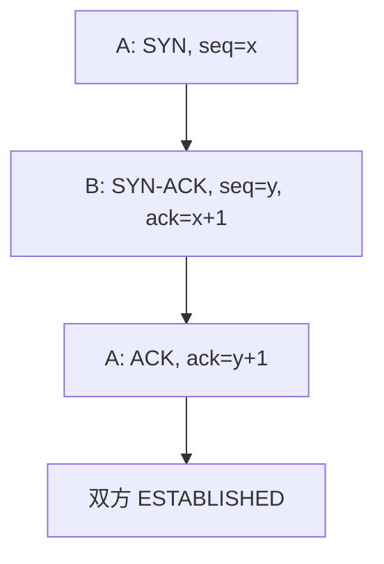

# TCP 三次握手

双方交换初始序号并确认，才能在不可靠的数据报上开始一条有状态的字节流。

<footer>—— 据 Postel, RFC 793, Transmission Control Protocol, 1981 整理</footer>

[上一课](/cs/udp-checksum)把数据报送到端口，没有约定「我们在流的第几个字节」。IP 会丢、会重，两端必须同步序号空间。缺口是 **TCP 连接建立**：三次握手，SYN、SYN-ACK、ACK。本课不把重传定时器与窗口写完。

## 问题

若一方直接发数据，对端不知道序号从哪起，也无法区分旧连接的迟到包。RFC 793：每端选初始序号（ISN），SYN 消耗一个序号。三次：A 的 SYN，B 的 SYN+ACK（确认 A 的 ISN+1 并带上 B 的 ISN），A 的 ACK。缺口是这次状态同步，不是拥塞控制。

同时打开与复位（RST）点名即可，状态机不全画。

三次才能让双方都收到对方的 ISN 并确认。两次不够：对端无法确认「你看见了我的 ISN」。ISN 应难以猜测，安全课再谈；本课只要求两端各有一个。

## 方法

被动端 `listen`；主动端 `connect` 发 SYN。内核为四元组分配控制块（TCB），状态从 SYN-SENT / SYN-RECEIVED 到 ESTABLISHED。握手段可以不带应用数据（经典），或带（TFO 等后话，不展开）。失败：超时重发 SYN，或收到 RST。

## 机制

握手把无连接的 IP/UDP 世界换成有连接表的内核对象，为后课累计确认与窗口准备「当前期望序号」。它仍不保证之后的字节到达——那是重传课。与[系统调用](/cs/syscall-path)接头：`connect`/`accept` 在握手完成前可阻塞，调度去跑别人。

[NAT](/cs/dhcp-nat) 在 SYN 时建表项；半开连接会占资源（SYN 洪泛是安全课）。

## 边界

本课不把四次挥手的 TIME_WAIT 写全，只承认连接还有拆除。不引入 QUIC 的 1-RTT；对照在 QUIC 课。也不把 TLS 握手并进三次里——应用明文 TCP 可以先建连接。序号如何覆盖丢失段，下一课。

ISN 随时间与随机性变化，减轻旧包落入新连接。同时打开是两边都发 SYN 的对称情形，RFC 793 允许，实现少见。

监听队列满时新 SYN 可被丢或回 RST，这是服务器容量，不是协议缺少第四次握手。

后课默认：ESTABLISHED 后双方有 ISN。字节的累计确认与超时重传，下一课。

## 小结

- 三次握手同步双方 ISN（RFC 793）。
- 连接是内核状态，不是 IP 的性质。
- 丢失段如何重发是下一课。
- 出处：RFC 793；Kurose and Ross。
