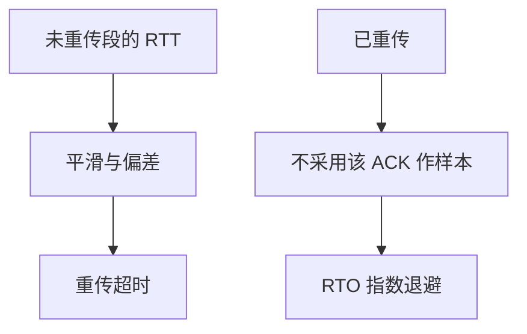
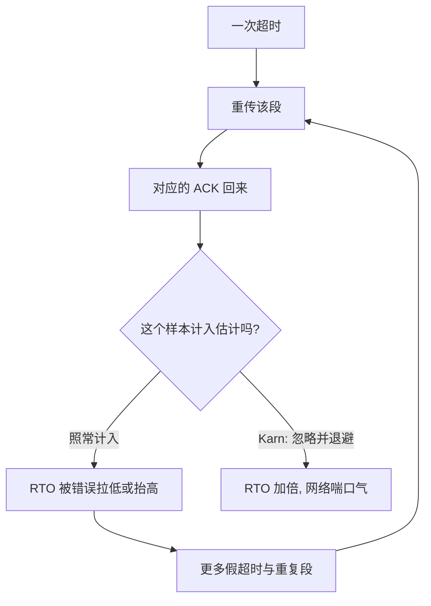

# RTO 与 Karn

重传超时必须跟着测量到的往返时间走；一次重传之后的 ACK 不能用来更新估计，否则会把超时越调越乱。

<footer>—— 据 RFC 793 的超时重传；Karn and Partridge, 1987；Kurose and Ross</footer>

[上一课](/cs/tcp-seq-rexmit)给出序号、累计 ACK 与「丢了就重发」。本课不重讲滑动前缀。缺口是**何时**重发：超时太短则假重传挤网络，太长则空等。[拥塞控制](/cs/tcp-congestion)还没开课，但 RTO 已经会制造重复段。Karn 算法处理「这段是第一次发还是重发的」的歧义。

## 问题

RTT 随路径变。RFC 793 已有重传，工程上用平滑 RTT 与均值偏差（Jacobson）设 RTO。若某段重传过，回来的 ACK 无法对应哪一次发送，把这次样本算进估计会系统性偏低或偏高。Karn：忽略重传段的 RTT 样本，并在重传时指数退避 RTO。缺口是**定时器与估计的一致性**，不是选择确认。

时间戳选项后来让重传段也可测 RTT，那是对 Karn 的补充，不是取消「测不准就别更新」。假超时仍会进入拥塞响应，后课再收。

## 方法

对未重传的段：采样 RTT，更新平滑值与偏差，RTO = 平滑 + 系数×偏差，并设下限。超时：重传最早未确认段，RTO 加倍，直到收到新 ACK 再按测量恢复。快速重传（三重复 ACK）是另一条丢包信号，其定时器交互留给后课 SACK/拥塞。

```mermaid
flowchart TD
  SAMPLE["未重传段的 RTT"] --> EST["平滑与偏差"]
  EST --> RTO["重传超时"]
  REX["已重传"] --> KARN["不采用该 ACK 作样本"]
  KARN --> BACK["RTO 指数退避"]
```

数字实例：若平滑 RTT 测得 100 毫秒、偏差 20 毫秒，RTO 就是 100 + 4×20 = 180 毫秒；若低于协议下限（如 200 毫秒）则按下限取。太短会重发其实没丢的段，太长则真丢了还干等。

## 机制

RTO 把「IP 会丢」翻译成发送方的时钟。估计错误时，[端到端](/cs/layering-e2e) 仍最终可靠（重传到对），但延迟与负载变差。Karn 避免正反馈：超时 → 重传 → 错误样本 → 更小 RTO → 更多超时。

Karn 到底拦住了什么？把"重传样本照常计入"的坏回路画出来就清楚了：

```mermaid
flowchart TD
  TO["一次超时"] --> REX["重传该段"]
  REX --> ACK2["对应的 ACK 回来"]
  ACK2 --> Q{"这个样本计入估计吗?"}
  Q -->|"照常计入"| BAD["RTO 被错误拉低或抬高"]
  BAD --> MORE["更多假超时与重复段"]
  MORE --> REX
  Q -->|"Karn: 忽略并退避"| OK["RTO 加倍, 网络喘口气"]
```

术语翻译：Karn 算法就是"分不清这份确认对应原件还是复印件，就干脆别拿来校准钟表"——重传过的段，其 ACK 两种可能都成立，拿去估计 RTT 必然把钟调歪。

## 边界

本课不把 Linux 的 min RTO 默认值当 RFC 正文，不引入 F-RTO 全部细节。累计 ACK 仍不能告诉发送方「中间哪块到了」，下一课 SACK。

后课默认：超时按测量走，重传段不污染 RTT。块状丢失的信息下一课补。

常见误区：把指数退避当成"失败信号"。它其实是给抖动的网络留恢复时间——RTO 从 200 毫秒退到 400、800 毫秒，路径恢复正常、收到新确认后会重新按测量降回来，不是永久变慢。

## 小结

- RTO 跟随 RTT；Karn 丢掉有歧义的样本并退避。
- 假超时会制造重复段。
- 选择确认下一课。
- 出处：RFC 793；Karn and Partridge, 1987；Kurose and Ross。
