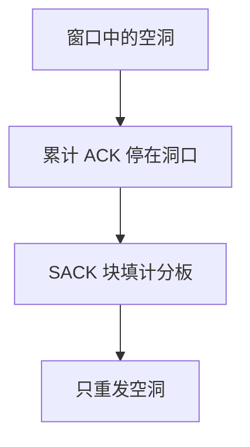

# SACK

累计 ACK 只推进前缀；选择确认把已收到的不连续块告诉发送方，重传针对空洞而不是从洞口整段重来。

<footer>—— 据 RFC 2018 选择确认；RFC 793 的累计确认仍是基线；Kurose and Ross</footer>

[上一课](/cs/tcp-rto)钉死何时超时重传。本课不重做 Karn。缺口是丢包形状：窗口里丢了中间几段时，累计 ACK 反复报同一个前缀，发送方只能猜或超时后从洞口重拉。SACK 选项列出已收到的序号块。本课不把接收窗口通告写完。

## 问题

[序号与重传](/cs/tcp-seq-rexmit) 用累计 ACK。管道长、窗口大时，一次丢几个段会导致不必要的重传（Go-Back-N 式浪费）。SACK：接收方在 ACK 里带若干块「左沿、右沿」；发送方维护计分板，只重发未被累计也未被 SACK 覆盖的段。缺口是**空洞的显式信号**，仍服从累计 ACK 推进提交序号。

SACK 是选项，需握手协商。DSACK 后来报告重复收到的块，帮助区分重传与乱序。本课只钉选择确认的数据平面。

## 方法

接收乱序段：缓存在重组队列，发 ACK（常带 SACK）。发送方根据计分板决定重传集合；累计 ACK 前移时裁掉计分板前缀。与 RTO 的关系：SACK 不取消超时，只减少盲目重传。流控窗口下一课才限制「能飞多少」。

## 机制

SACK 把接收缓冲的占用情况部分暴露给发送方，使重传与 [DMA](/cs/io-dma) 进出的字节更接近真实丢失。它不增加可靠性规格：没有 SACK 的 TCP 仍可靠，只是更慢、更浪费。端到端校验与序号仍然是正确性来源。

## 边界

本课不把 FACK 与全部恢复算法当标准必背，不引入 QUIC 的 ACK 范围作为本课对象（后课对照）。接收方还能收多少字节，下一课 `rwnd`。

后课默认：发送方可以知道哪些块已到。发送太多仍会淹没对端缓冲，下一课流控。

## 小结

- SACK 报告不连续块；重传对准空洞。
- 累计 ACK 仍是提交前缀。
- 接收窗口是下一课。
- 出处：RFC 2018；RFC 793；Kurose and Ross。
