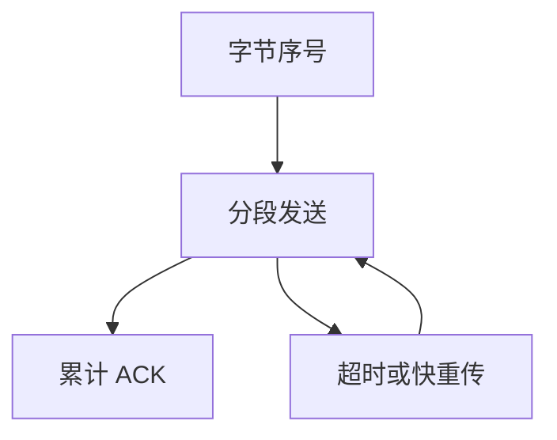

# 序号与重传

每个字节一个序号；累计确认告诉发送方前缀已到。丢了就按定时器或重复确认重发。

<footer>—— 据 RFC 793；Karn and Partridge, Improving Round-Trip Estimates in Reliable Transport Protocols, 1987 整理</footer>

[上一课](/cs/tcp-time-wait)同步了 ISN。IP 仍会丢包。[端到端](/cs/layering-e2e)要求两端保证字节流。缺口是**序号、累计 ACK、重传**：把数据报变成可靠流的数据平面。本课不把接收窗口与拥塞窗口分开写完。

## 问题

载荷从 ISN+1 起编号。接收方 ACK 表示「期望的下一个字节」。丢失则发送方超时重传；RTO 必须估 RTT，估低了假重传，估高了延迟。Karn：重传段不拿来更新 RTT，避免歧义。缺口不是再握手，而是这条可靠机。

快速重传：三个重复 ACK 暗示该序号丢了，可不等 RTO。本课点名，与拥塞反应的耦合下一课之后。

累计 ACK 不描述空洞后已到达的段。SACK（RFC 2018）补上块信息，主干先掌握累计语义。

## 方法

发送：切段、填序号、启动该段的计时（实现常一个 RTO 时钟）。接收：按序号写入重组缓冲，交有序前缀给应用，发 ACK。重复段丢弃。校验和失败当丢。与 [UDP](/cs/udp) 对照：UDP 把乱序交给应用；TCP 藏在内核里。

## 机制

序号让迟到的旧连接段（若 ISN 与时间窗配合）可被拒绝；让重复可识别。重传实现端到端文件传输的「最终到」，链路 FCS 只是降丢包率。与[管道](/cs/ipc-pipe)对照：管道丢数据只在内核崩溃；TCP 假定中间网络会丢。

RTO 与[调度](/cs/scheduling-metrics)交互：超时线程可能睡醒重发，不占 CPU 忙等。

## 边界

本课不把时间戳选项与 PAWS 写完。不引入纠删码代替重传。流控（接收方缓冲）与拥塞（网络）尚未拆开：下一课窗口先谈接收方。

序号 32 位，高速长时间连接要 PAWS 用时间戳防回绕。本课假定窗口内无回绕歧义。

后课默认：丢失由序号与重传补齐。接收方缓冲有限时发送方必须减速，下一课流控窗口。

## 小结

- 字节编号 + 累计 ACK + RTO/快重传 = 可靠前缀。
- Karn 规则处理重传下的 RTT 歧义。
- 接收窗口是下一课；网络拥塞是再下一课。
- 出处：RFC 793；Karn and Partridge, 1987；Kurose and Ross。
