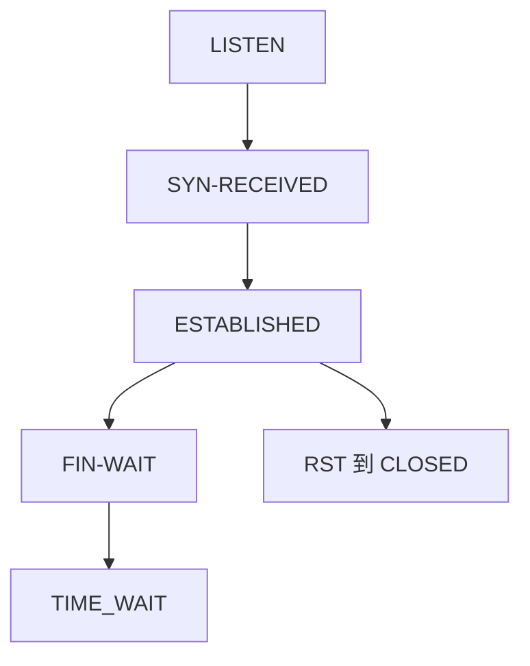

# TCP 状态机

连接是状态机：LISTEN、握手三态、ESTABLISHED、四次挥手各态；错误的迁移比错一个 cwnd 更容易把套接字卡死。

<footer>—— 据 RFC 9293 第 3.3 节；Stevens, TCP/IP Illustrated 状态图整理</footer>

主干[三次握手](/cs/tcp-handshake) 与 [TIME_WAIT](/cs/tcp-time-wait) 已拆过。[上一课](/cs/mss-clamping) 发生在 SYN 上。缺口是**整图**：11 个状态怎么迁，ABORT vs 优雅关。本课不把 SYN cookie 写完。

## 问题

应用看 ESTABLISHED 与 close。内核还要 SYN-SENT、SYN-RECEIVED、FIN-WAIT-1/2、CLOSING、CLOSE-WAIT、LAST-ACK、TIME_WAIT。同时打开、同时关闭是边角。RST 从多数态回到 CLOSED。半开：一边已关或崩溃，另一边还 ESTABLISHED——保活后课。窗口缩放只在 SYN 协商，状态错了不能补选项。

不要把状态机写成拥塞控制；cwnd 是 ESTABLISHED 里的变量。

RFC 9293 图 5。本课不把每条错误迁移画成考试填空，只钉主路径与 TIME_WAIT 理由（已在主干）。

### 拥塞变量栖在 ESTABLISHED

应用 close 不等于 CLOSED。RST 中止；TIME_WAIT 防旧段。同时打开是规范允许的边角。

## 方法

画主路径：LISTEN → SYN-RCVD → EST → 主动关 FIN-WAIT → TIME_WAIT。对照 QUIC：连接 ID 迁移后课，状态更少暴露。

方法止于选定对象与对照；机制才说它如何嵌入已有分层与主干课。

## 机制

SYN 泛洪把 SYN-RCVD 队列填满，下一课 cookies。LACP 与路由变化不改状态机，只改路径。抓包排障：看标志位对状态，比看窗口更先。incast 不改状态，只改拥塞变量。

同时打开：双方 SYN-SENT → SYN-RCVD → EST，序号交叉，规范允许。

## 边界

本课不引入 TCP 快速打开的全部 cookie。SYN cookies 是下一课。后课默认：套接字生命周期 = 这份状态机；应用 close 不等于立刻 CLOSED。

把 TIME_WAIT 当泄漏而全局关，会制造旧段串连接。

上一课留下的缺口在本课收口；「TCP 状态机」进入后课词汇表后只引用。文献用来钉对象与边界，不把本课写成该主题的独立综述。下一课[SYN cookies](/cs/syn-cookies)。

## 小结

- 主路径：听、握、传、挥、TIME_WAIT。
- RST 中止；半开留给保活课。
- 拥塞变量栖在 ESTABLISHED。
- 后课只引用本课钉死的对象，不从该领域总问题重开。
- 出处：RFC 9293；Stevens。
