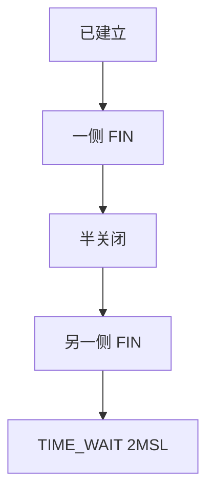

# 四次挥手与 TIME_WAIT

连接的两端各自关闭发送方向；主动关闭的一方在 TIME_WAIT 里停留 2MSL，让迟到的报文自然死掉。

<footer>—— 据 Postel, RFC 793；Kurose and Ross 对连接拆除的整理</footer>

[上一课](/cs/tcp-handshake)用三次握手同步了 ISN，连接进入已建立。本课不重画 SYN 交换。缺口是拆除：TCP 是全双工，一侧 FIN 只表示「我不再发」。主动关闭方必须处理旧连接的迟到包与对端最后 ACK 的丢失。TIME_WAIT 是这份合同，不是内核随意占着端口。

## 问题

握手建立的是两条方向的序号空间。关闭：FIN 与 ACK 各来一回，共四段（可合并成三次，语义仍是两边关发送）。若主动方在收到最后 ACK 后立刻释放四元组，迟到的 FIN 或数据可能被新连接（同一四元组复用）当成合法。RFC 793：在 TIME_WAIT 保持 2MSL。缺口是**拆除与四元组回收**，不是重传定时器公式。

MSL 是报文最大生存时间的约定。RST 可以更快拆掉，但不代替正常 FIN 对未读数据的交付。半关闭允许一边仍发。

## 方法

应用 `close` 或 shutdown 发送方向 → 发 FIN。对端 ACK，自己还可发送直到也 FIN。主动方进入 TIME_WAIT，丢弃迟到段或应答，到期后删除控制块。重传丢失的最后 ACK 靠对端重传 FIN。本课不把同时打开/同时关闭的全部状态图画成考试默写。

## 机制

TIME_WAIT 把[端到端](/cs/layering-e2e)的「旧段不能冒充新流」落在时间上，因为 IP 没有连接 ID 世代号（后课 QUIC 才有连接标识）。端口耗尽是它的运营症状，不是协议写错。序号与重传下一课才保证数据平面可靠；拆除课只保证状态机不把尸体当新生儿。

## 边界

本课不引入 SO_REUSEADDR 的全部平台语义当标准，不把负载均衡器上的四元组规模写成调参手册。字节如何编号、丢了如何重发，下一课。

后课默认：连接能对称关闭，主动方会在 TIME_WAIT 停留。数据可靠是另一缺口。

## 小结

- 四次挥手关两个方向；TIME_WAIT 挡迟到段。
- 半关闭合法；RST 是另一条路。
- 序号与重传下一课。
- 出处：RFC 793；Kurose and Ross。
