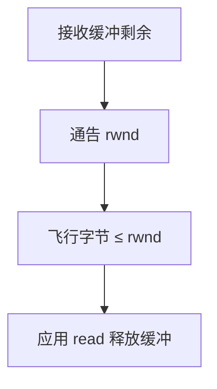

# 流控与窗口

接收窗口通告还能再收多少字节；发送方不得让未确认数据超出窗口，以免淹没对端。

<footer>—— 据 RFC 793 窗口字段；Kurose and Ross 对滑动窗口的整理</footer>

[上一课](/cs/tcp-sack)保证最终送达，若发送方无视接收缓冲，重传队列会在接收端溢出，只能丢——再重传，活锁。缺口是**流控**：滑动窗口，通告 `rwnd`。本课不把拥塞窗口 `cwnd` 当作同一旋钮。

## 问题

套接字接收缓冲有限，进程可能不及时 `read`（调度在跑别人）。TCP 头窗口字段告诉对端：可发送的序号上限 = ACK + rwnd。发送方维护已发送未确认的飞行字节 ≤ rwnd。缺口不是 ISN，而是这条信用。零窗口时对端停发，稍后窗口更新；为防更新丢失，有持续定时器探一字节。

本课不把糊涂窗口综合症的全部修复代码写完，只承认小窗口应避免。

滑动窗口把流水线引入重传课的停等：带宽时延积大时，窗口必须够大，否则链路空转。

## 方法

接收：应用取走数据则 rwnd 增大，发窗口更新。发送：新数据与重传都受 rwnd 限制。与[管程](/cs/monitor-condvar)类比：缓冲满则发送方在内核睡，像管道写端；唤醒来自收到更大窗口或 ACK。

## 机制

流控保护**端**，不保护中间路由器队列——那是拥塞控制。两者都限制飞行字节，但信号来源不同：rwnd 来自对端主机，丢包来自网络。实现取 `min(rwnd, cwnd)`，cwnd 下一课才出现。端到端：流控是两端协商，符合 Saltzer；交换机的 PAUSE 是链路层另一回事。

与 DMA：网卡可以比应用快，窗口把不匹配关在传输层，而不是让内核无限占页。

## 边界

本课不引入接收卸载的硬件窗口。不把 BDP 测量实验写进主干。窗口缩放选项（RFC 7323）承认 16 位字段不够，点名即可。网络自己的队列溢出，下一课 AIMD。

发送方还受 MSS 与 Nagle 影响：小写可被合并。Nagle 与延迟 ACK 互相等待是经典坑，本课点名不调参。

窗口通告以字节计，不是以段计；MSS 只限制单段大小。

后课默认：发送受接收窗口约束。网络拥塞时即使 rwnd 很大也要减速，下一课拥塞控制。

## 小结

- rwnd 是接收方信用；滑动窗口流水线化可靠传输。
- 保护端缓冲，不保护路由器。
- 拥塞窗口是另一条上限，下一课。
- 出处：RFC 793；Kurose and Ross；Tanenbaum *Computer Networks*。
